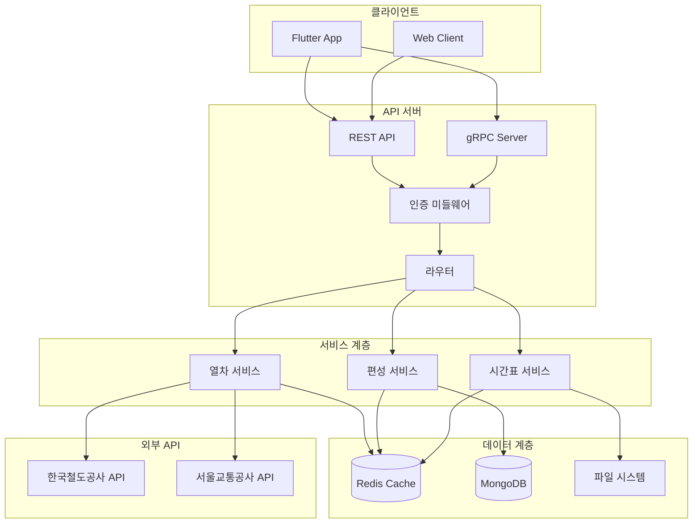
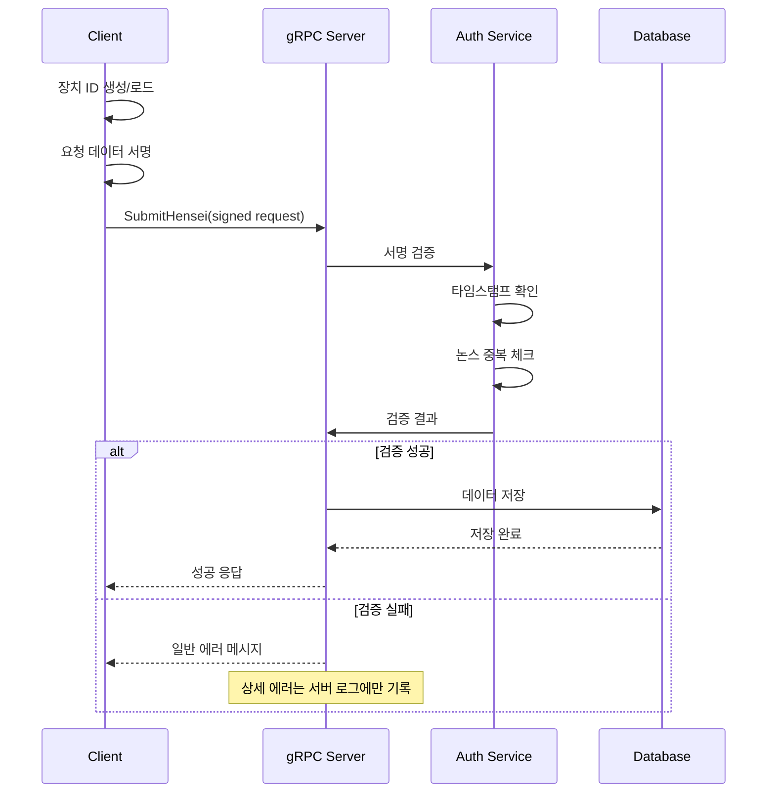

# TrainAccAPI

서울 지하철 실시간 정보 제공 API 서버

## 📱 프로젝트 개요

TrainAccAPI는 서울 지하철 및 철도 네트워크의 실시간 정보를 제공하는 Node.js 기반 API 서버입니다. RESTful API와 gRPC를 통해 열차 위치, 시간표, 편성 정보 등을 제공합니다.

### 주요 기능
- 🚇 **실시간 열차 추적**: 열차 위치 및 상태 정보 제공
- 📍 **역별 정보**: 역별 시간표 및 도착 정보
- 🎯 **편성 정보 관리**: 사용자 제보 기반 열차 편성 정보
- 🌐 **다중 프로토콜**: REST API + gRPC 지원
- 🔒 **보안 통신**: 장치 인증 및 서명 검증

## 🏗️ 시스템 아키텍처



## 🔧 기술 스택

- **런타임**: Node.js
- **프레임워크**: Express.js
- **프로토콜**: REST API + gRPC
- **데이터베이스**: MongoDB, Redis
- **인증**: JWT + 디지털 서명
- **로깅**: Winston
- **API 문서**: Swagger

## 🔒 보안 기능

### gRPC 보안 구현
- **장치 인증**: 클라이언트 장치별 고유 ID 및 공개키 관리
- **서명 검증**: HMAC-SHA256 기반 요청 서명
- **재사용 방지**: 타임스탬프 및 논스 검증
- **Rate Limiting**: 장치별 요청 제한

### 에러 처리
- 서버 내부에서만 상세 에러 로깅
- 클라이언트에는 일반화된 에러 메시지 전달
- 보안 정보 유출 방지

## 📂 프로젝트 구조

```
TrainAccAPI/
├── src/
│   ├── app.js                # 앱 진입점
│   ├── routes/               # API 라우트
│   │   ├── adminRouter.js    # 관리자 API
│   │   ├── henseiRouter.js   # 편성 정보 API
│   │   ├── lineRouter.js     # 노선 정보 API
│   │   ├── trainRouter.js    # 열차 정보 API
│   │   └── deviceRouter.js   # 장치 등록 API
│   ├── grpc/                 # gRPC 서버
│   │   └── henseiServer.js   # 편성 gRPC 서비스
│   ├── services/             # 비즈니스 로직
│   │   ├── trainService.js   # 열차 추적 서비스
│   │   ├── henseiService.js  # 편성 관리 서비스
│   │   └── schedService.js   # 시간표 서비스
│   ├── middlewares/          # Express 미들웨어
│   │   └── Auth.js          # 인증 미들웨어
│   └── utils/                # 유틸리티
│       ├── log.js           # 로깅 설정
│       └── time.js          # 시간 유틸리티
├── proto/                    # Protocol Buffer 정의
│   └── hensei.proto         # 편성 서비스 proto
├── data/                     # 정적 데이터
│   ├── schedule/            # 시간표 JSON
│   └── stationNm.json       # 역 정보
└── static/                   # 정적 파일
```

## 🚀 설치 및 실행

### 필수 요구사항
- Node.js 16+
- MongoDB 4.4+
- Redis 6+

### 환경 설정
1. `.env` 파일 생성:
```env
PORT=3000
SSLPORT=3443
DBCONN=mongodb://localhost:27017/trainacc
REDISCONN=redis://localhost:6379
REDISDBNUM=0
CERTFOLDER=./data/cert
```

### 설치
```bash
# 의존성 설치
npm install

# 개발 모드 실행
npm run dev

# 프로덕션 모드 실행
npm run prod
```

## 📡 API 엔드포인트

### REST API

#### 열차 정보
- `GET /train/:lineNum` - 노선별 열차 목록
- `GET /train/:lineNum/:trainNum` - 특정 열차 상세 정보

#### 편성 정보
- `POST /hensei` - 편성 정보 제출 (REST)
- `GET /hensei/:lineNum/:trainNum` - 편성 정보 조회

#### 노선 정보
- `GET /line/:lineId` - 노선 정보 조회
- `GET /line/multiline` - 다중 노선 정보

#### 장치 관리
- `POST /device/register` - 장치 공개키 등록

### gRPC API

#### 편성 서비스
- `SubmitHensei` - 보안 강화된 편성 정보 제출
  - 장치 인증 필수
  - 서명 검증
  - 중복 제출 방지

## 🔐 gRPC 통신 흐름



## 📊 모니터링 및 로깅

### Winston 로깅
- 모든 API 요청/응답 로깅
- 에러 상세 정보 기록
- 성능 메트릭 추적

### 로그 레벨
- `error`: 시스템 에러
- `warn`: 경고 사항
- `info`: 일반 정보
- `debug`: 디버그 정보

## 🧪 테스트

```bash
# 단위 테스트 실행
npm test

# 통합 테스트
npm run test:integration
```

## 🤝 기여 가이드

1. 이슈 생성
2. 브랜치 생성 (`feature/기능명`)
3. 커밋 (`feat: 새로운 기능 추가`)
4. 푸시 및 PR 생성

### 커밋 메시지 규칙
- `feat`: 새로운 기능
- `fix`: 버그 수정
- `docs`: 문서 수정
- `style`: 코드 포맷팅
- `refactor`: 코드 리팩토링
- `test`: 테스트 추가
- `chore`: 빌드 작업 등

