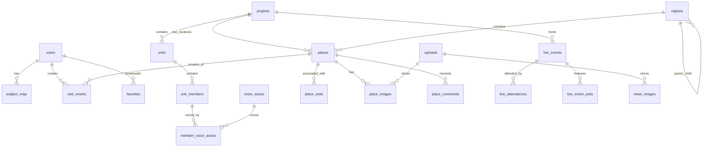

# 데이터베이스 설계 가이드 v1.1.0 🗄️
**Girls Band Tabi - 데이터베이스 아키텍처**

**최신 업데이트**: 2025년 11월 17일  
**버전**: v1.1.0  
**상태**: ✅ 최신  
**대상**: 개발자, 데이터베이스 관리자, DevOps 엔지니어

## 목차

1. [개요](#개요)
2. [데이터베이스 스키마 아키텍처](#데이터베이스-스키마-아키텍처)
3. [PostgreSQL + PostGIS 설정](#postgresql--postgis-설정)
4. [엔티티 관계](#엔티티-관계)
5. [공간 데이터 설계 패턴](#공간-데이터-설계-패턴)
6. [마이그레이션 전략 & Flyway](#마이그레이션-전략--flyway)
7. [인덱싱 전략](#인덱싱-전략)
8. [성능 고려사항](#성능-고려사항)
9. [쿼리 최적화](#쿼리-최적화)
10. [데이터 시딩 & 테스트 데이터](#데이터-시딩--테스트-데이터)
11. [커넥션 풀링 (HikariCP)](#커넥션-풀링-hikaricp)
12. [백업 & 유지보수](#백업--유지보수)
13. [일반적인 공간 쿼리](#일반적인-공간-쿼리)
14. [문제 해결](#문제-해결)

## 개요

Girls Band Tabi 프로젝트는 위치 기반 성지순례(pilgrimage) 애플리케이션을 관리하기 위해 PostGIS 확장(extension)이 포함된 PostgreSQL 데이터베이스를 사용합니다. 이 시스템은 여러 걸그룹 프로젝트, 지리적 위치 추적, 사용자 생성 콘텐츠(UGC), 라이브 이벤트 관리를 지원합니다.

### 핵심 기능 (Core Features)
- **다중 프로젝트 지원 (Multi-Project Support)**: 단일 데이터베이스에서 여러 걸그룹 프로젝트 관리
- **지리공간 기능 (Geospatial Features)**: 정밀한 위치 추적 및 근접성(proximity) 계산을 위한 PostGIS
- **사용자 생성 콘텐츠 (User-Generated Content)**: 댓글, 사진, 방문 기록 추적
- **라이브 이벤트 (Live Events)**: 콘서트 장소 및 참석자 추적
- **미디어 관리 (Media Management)**: 이미지 업로드 및 메타데이터(metadata) 저장
- **감사 추적 (Audit Trail)**: 포괄적인 로깅(logging) 및 감사 시스템

### 기술 스택 (Technology Stack)
- **데이터베이스 (Database)**: PostgreSQL 15 with PostGIS 3.3
- **ORM**: 최적화된 JPA/Hibernate
- **커넥션 풀 (Connection Pool)**: HikariCP
- **마이그레이션 (Migration)**: Flyway
- **캐싱 (Caching)**: Redis + Caffeine
- **공간 라이브러리 (Spatial Library)**: JTS (Java Topology Suite)

## 데이터베이스 스키마 아키텍처

### 핵심 도메인 모델

데이터베이스는 다음 주요 도메인을 중심으로 구성됩니다:

```
├── 신원 및 보안 (Identity & Security)
│   ├── users (인증 및 프로필)
│   ├── subject_map (OAuth 주체 매핑)
│   ├── email_verification_tokens (이메일 인증)
│   └── audit_log (보안 감사 추적)
│
├── 프로젝트 및 콘텐츠 (Projects & Content)
│   ├── projects (걸그룹 프로젝트)
│   ├── units (프로젝트 내 밴드/그룹)
│   ├── unit_members (개별 멤버/캐릭터)
│   ├── voice_actors (성우 정보)
│   └── member_voice_actors (캐릭터-성우 관계)
│
├── 지리적 데이터 (Geographical Data)
│   ├── regions (계층적 위치 데이터)
│   ├── places (PostGIS 지오메트리를 포함한 물리적 위치)
│   ├── place_units (장소-밴드 연관)
│   ├── place_images (위치 사진)
│   ├── place_guides (사용자 생성 가이드)
│   └── place_comments (사용자 댓글 및 리뷰)
│
├── 이벤트 및 방문 (Events & Visits)
│   ├── live_events (콘서트 및 공연)
│   ├── live_attendances (사용자 참석 기록)
│   ├── visit_events (위치 체크인)
│   └── visit_summary (집계된 방문 통계)
│
├── 미디어 및 콘텐츠 (Media & Content)
│   ├── uploads (파일 메타데이터 및 저장소 참조)
│   ├── media_catalogs (미디어 콘텐츠 카탈로그)
│   ├── media_entries (개별 에피소드/챕터)
│   ├── news_items (뉴스 및 공지사항)
│   └── media_delete_requests (콘텐츠 조정)
│
└── 커뮤니티 기능 (Community Features)
    ├── posts (사용자 생성 게시물)
    ├── comments (게시물 댓글)
    ├── favorites (사용자 북마크)
    ├── notifications (사용자 알림)
    └── notification_settings (알림 설정)
```

### 데이터베이스 설계 원칙 (Database Design Principles)

1. **애플리케이션 관리 관계 (Application-Managed Relationships)**: 연쇄 문제(cascade issues)를 피하기 위한 최소한의 외래키 제약(foreign key constraints)
2. **빠른 필터링을 위한 배열 컬럼 (Array Columns for Fast Filtering)**: 성능을 위한 GIN 인덱스가 있는 PostgreSQL 배열
3. **소프트 삭제 (Soft Delete)**: 하드 삭제 대신 `is_active` 플래그 사용
4. **낙관적 잠금 (Optimistic Locking)**: 동시 접근 제어를 위한 버전 필드
5. **감사 추적 (Audit Trail)**: 보안 및 디버깅을 위한 포괄적 로깅
6. **공간 인덱싱 (Spatial Indexing)**: 지리적 쿼리(geographical queries)를 위한 PostGIS GIST 인덱스

### 2025-11-17 스키마 업데이트 — `places.intro_text`
- `V002__create_core_tables.sql`에 `intro_text TEXT` 열을 추가해 카드/공유용 짧은 소개 문구를 1급 속성으로 승격했습니다.
- 데이터 시딩 마이그레이션(`V033__add_places_data.sql`)은 `intro_text`가 비어 있는 행을 `LEFT(description, 200)`로 자동 초기화하여 과거 데이터도 즉시 UI에 노출할 수 있습니다.
- 애플리케이션 계층은 `Create/UpdatePlaceRequest`에 `introText`를 허용하며, 값이 없으면 `description` 앞부분을 잘라 자동 보정합니다.

```sql
ALTER TABLE places
    ADD COLUMN IF NOT EXISTS intro_text TEXT;

UPDATE places
SET intro_text = LEFT(description, 200)
WHERE intro_text IS NULL
  AND description IS NOT NULL;
```

## PostgreSQL + PostGIS 설정 (PostgreSQL + PostGIS Setup)

### 필수 확장 (Required Extensions)

```sql
-- Core PostgreSQL extensions
CREATE EXTENSION IF NOT EXISTS "uuid-ossp";
CREATE EXTENSION IF NOT EXISTS "pgcrypto";

-- PostGIS for geospatial features
CREATE EXTENSION IF NOT EXISTS postgis;
CREATE EXTENSION IF NOT EXISTS postgis_topology;
CREATE EXTENSION IF NOT EXISTS btree_gist;
```

### Docker 설정 (Docker Configuration)

프로젝트는 개발을 위해 PostGIS Docker 이미지를 사용합니다:

```yaml
# docker-compose.yml
database:
  image: postgis/postgis:15-3.3
  platform: "linux/amd64"
  environment:
    POSTGRES_DB: girlsbandtabi
    POSTGRES_USER: girlsbandtabi
    POSTGRES_PASSWORD: ${POSTGRES_PASSWORD}
  volumes:
    - ./docker-data/postgres:/var/lib/postgresql/data
```

### 연결 설정 (Connection Configuration)

```yaml
# application.yml
spring:
  datasource:
    url: jdbc:postgresql://localhost:5432/girlsbandtabi
    username: ${DB_USERNAME:girlsbandtabi}
    password: ${DB_PASSWORD:girlsbandtabi}
    driver-class-name: org.postgresql.Driver
    hikari:
      auto-commit: false
      maximum-pool-size: 20
      minimum-idle: 5
      connection-timeout: 30000
      idle-timeout: 600000
      max-lifetime: 1800000
```

## 엔티티 관계 (Entity Relationships)

### 핵심 엔티티 관계 (Core Entity Relationships)


<details>
<summary>Mermaid 원본 코드 보기</summary>



<!-- 데이터베이스 ERD (Entity Relationship Diagram) -->


</details>

### 주요 관계 패턴 (Key Relationship Patterns)

#### 1. 연결 테이블을 사용한 다대다 관계 (Many-to-Many with Junction Tables)
```sql
-- Place-Unit associations
CREATE TABLE place_units (
    place_id UUID NOT NULL,
    unit_id UUID NOT NULL,
    PRIMARY KEY (place_id, unit_id)
);
```

#### 2. 배열 기반 빠른 조회 (Array-Based Fast Lookups)
```sql
-- Places with denormalized arrays for fast filtering
CREATE TABLE places (
    id UUID PRIMARY KEY,
    project_ids UUID[] NOT NULL DEFAULT ARRAY[]::UUID[],
    unit_ids UUID[] NOT NULL DEFAULT ARRAY[]::UUID[],
    character_ids UUID[] NOT NULL DEFAULT ARRAY[]::UUID[],
    intro_text TEXT,
    -- ... other columns
);

-- GIN indexes for array operations
CREATE INDEX idx_places_project_ids_gin ON places USING GIN (project_ids);
CREATE INDEX idx_places_unit_ids_gin ON places USING GIN (unit_ids);
```

#### 3. 계층적 데이터 - 지역 (Hierarchical Data - Regions)
```sql
-- Self-referencing hierarchy
CREATE TABLE regions (
    region_code VARCHAR(32) PRIMARY KEY,
    parent_code VARCHAR(32), -- Self-reference
    region_type VARCHAR(20) NOT NULL,
    level SMALLINT NOT NULL,
    -- ... other columns
);
```

## 공간 데이터 설계 패턴 (Spatial Data Design Patterns)

### 지리 좌표계 (Geographic Coordinate System)

시스템은 모든 공간 데이터에 **EPSG:4326 (WGS84)**를 사용합니다:

```sql
-- PostGIS Point geometry with WGS84
location geography(Point, 4326) NOT NULL
```

### 공간 데이터 저장 (Spatial Data Storage)

#### Places 테이블 공간 설계 (Places Table Spatial Design)
```sql
CREATE TABLE places (
    id UUID PRIMARY KEY,
    location geography(Point, 4326) NOT NULL,
    verification_radius_m INT NOT NULL DEFAULT 10,
    address TEXT,
    region_code VARCHAR(32)
);

-- Spatial index for efficient proximity queries
CREATE INDEX idx_places_location_gist ON places USING GIST (location);
```

### 공간 쿼리 패턴 (Spatial Query Patterns)

#### 1. 근접성 검색 (Proximity Search)
```sql
-- Find places within 100 meters of a point
SELECT p.*
FROM places p
WHERE ST_DWithin(
    p.location::geometry,
    ST_GeomFromText('POINT(139.7005 35.6617)', 4326),
    100  -- meters
)
AND p.is_active = true;
```

#### 2. 위치 검증 (Location Verification)
```sql
-- Check if user location is within place verification radius
SELECT COUNT(*) > 0 as is_within_radius
FROM places p
WHERE p.id = $1
AND ST_DWithin(
    p.location::geometry,
    ST_GeomFromText('POINT($2 $3)', 4326),
    p.verification_radius_m
);
```

#### 3. 지역 쿼리 (Regional Queries)
```sql
-- Places within a region (using bounding box)
SELECT p.*
FROM places p
JOIN regions r ON p.region_code = r.region_code
WHERE r.country_code = 'JPN'
AND p.is_active = true;
```

### 공간 쿼리 성능 최적화 (Spatial Query Performance Optimization)

1. **적절한 인덱스 사용 (Proper Index Usage)**:
   ```sql
   CREATE INDEX idx_places_location_gist ON places USING GIST (location);
   CREATE INDEX idx_places_location_active ON places USING GIST (location) 
   WHERE is_active = true;
   ```

2. **거리 계산을 위해 geography를 geometry로 변환 (Convert geography to geometry for distance calculations)**:
   ```sql
   -- More efficient for short distances
   ST_DWithin(location::geometry, target::geometry, distance)
   ```

3. **대규모 지역에 대한 경계 상자 쿼리 사용 (Use bounding box queries for large areas)**:
   ```sql
   WHERE location && ST_MakeEnvelope(min_lon, min_lat, max_lon, max_lat, 4326)
   ```

## 마이그레이션 전략 & Flyway (Migration Strategy & Flyway)

### Flyway 설정 (Flyway Configuration)

```yaml
# application.yml
flyway:
  enabled: true  # Environment-specific
  url: jdbc:postgresql://localhost:5432/girlsbandtabi
  user: ${DB_USERNAME:girlsbandtabi}
  password: ${DB_PASSWORD:girlsbandtabi}
  locations: classpath:db/migration
  baseline-on-migrate: true
  baseline-version: 000
  validate-on-migrate: false
  out-of-order: true
  mixed: true
  ignore-migration-patterns: "*:missing,*:ignored"
```

### 마이그레이션 명명 규칙 (Migration Naming Convention)

```
V{version}__{description}.sql

Examples:
V001__enable_extensions.sql
V002__create_core_tables.sql
V035__optimize_place_region_mapping.sql
V091__add_places_array_gin_indexes.sql
```

### 마이그레이션 모범 사례 (Migration Best Practices)

#### 1. 확장 기능 관리 (Extension Management)
```sql
-- V001__enable_extensions.sql
CREATE EXTENSION IF NOT EXISTS "uuid-ossp";
CREATE EXTENSION IF NOT EXISTS "pgcrypto";
CREATE EXTENSION IF NOT EXISTS postgis;
```

#### 2. 적절한 인덱싱을 포함한 테이블 생성 (Table Creation with Proper Indexing)
```sql
-- Create table with immediate indexes (즉시 인덱스와 함께 테이블 생성)
CREATE TABLE IF NOT EXISTS places (
    id UUID PRIMARY KEY DEFAULT uuid_generate_v4(),
    location geography(Point, 4326) NOT NULL,
    -- ... other columns
);

-- Add indexes immediately (즉시 인덱스 추가)
CREATE INDEX IF NOT EXISTS idx_places_location_gist ON places USING GIST (location);
```

#### 3. 안전한 컬럼 추가 (Safe Column Addition)
```sql
-- Add column with default value (기본값과 함께 컬럼 추가)
ALTER TABLE places ADD COLUMN IF NOT EXISTS verification_radius_m INT NOT NULL DEFAULT 10;

-- Update existing rows if needed (필요시 기존 행 업데이트)
UPDATE places SET verification_radius_m = 50 WHERE place_type = 'large_venue';
```

#### 4. 검증을 포함한 데이터 마이그레이션 (Data Migration with Validation)
```sql
-- Data transformation with error handling (오류 처리를 포함한 데이터 변환)
DO $$
DECLARE
    affected_count INTEGER;
BEGIN
    -- Perform update (업데이트 수행)
    UPDATE places SET region_code = 'JPN-13-101' 
    WHERE ST_DWithin(location::geometry, ST_GeomFromText('POINT(139.7 35.66)', 4326), 0.1);
    
    GET DIAGNOSTICS affected_count = ROW_COUNT;
    RAISE NOTICE 'Updated % places in Shibuya region', affected_count;
    
    -- Validation (검증)
    IF affected_count = 0 THEN
        RAISE WARNING 'No places updated - check coordinates';
    END IF;
END $$;
```

### 롤백 전략 (Rollback Strategy)

1. **추가적 변경 (Additive Changes)**: 일반적으로 롤백이 안전함
2. **파괴적 변경 (Destructive Changes)**: 항상 먼저 백업
3. **데이터 변환 (Data Transformation)**: 역 변환 포함

```sql
-- Example rollback for column addition
-- Rollback V035: Remove new region mappings
UPDATE places SET region_code = NULL WHERE region_code LIKE 'JPN-%';
```

## 인덱싱 전략 (Indexing Strategy)

### 인덱스 유형 및 사용법 (Index Types and Usage)

#### 1. B-tree 인덱스 - 기본값 (B-tree Index - Default)
```sql
-- Primary keys and unique constraints
CREATE UNIQUE INDEX idx_users_email ON users (email);

-- Query performance
CREATE INDEX idx_places_project_id ON places (project_id);
CREATE INDEX idx_places_created_at ON places (created_at);

-- Compound indexes for common query patterns
CREATE INDEX idx_places_project_active ON places (project_id, is_active) WHERE is_active;
```

#### 2. GIN 인덱스 - 배열 및 JSON 데이터 (GIN Index - Array and JSON Data)
```sql
-- Array columns for fast contains operations
CREATE INDEX idx_places_project_ids_gin ON places USING GIN (project_ids);
CREATE INDEX idx_places_unit_ids_gin ON places USING GIN (unit_ids);

-- JSONB columns
CREATE INDEX idx_email_verification_metadata_gin ON email_verification_tokens USING GIN (metadata);
```

#### 3. GIST 인덱스 - 공간 데이터 (GIST Index - Spatial Data)
```sql
-- PostGIS spatial indexes
CREATE INDEX idx_places_location_gist ON places USING GIST (location);
CREATE INDEX idx_visit_events_location_gist ON visit_events USING GIST (location);

-- Partial spatial indexes for active records
CREATE INDEX idx_places_location_active_gist ON places USING GIST (location) 
WHERE is_active = true;
```

#### 4. 부분 인덱스 (Partial Indexes)
```sql
-- Index only active records
CREATE INDEX idx_places_active ON places (is_active) WHERE is_active;

-- Index only published content
CREATE INDEX idx_news_items_published_time ON news_items (published_at DESC) 
WHERE is_published;
```

#### 5. 표현식 인덱스 (Expression Indexes)
```sql
-- Index on computed values
CREATE INDEX idx_places_location_text ON places (lower(address)) 
WHERE address IS NOT NULL;
```

### 인덱스 모니터링 (Index Monitoring)

#### 1. 인덱스 사용량 확인 (Check Index Usage)
```sql
-- Find unused indexes
SELECT schemaname, tablename, indexname, idx_tup_read, idx_tup_fetch
FROM pg_stat_user_indexes 
WHERE idx_tup_read = 0 AND idx_tup_fetch = 0;
```

#### 2. 인덱스 효과성 분석 (Index Effectiveness Analysis)
```sql
-- Check index bloat
SELECT schemaname, tablename, indexname,
       pg_size_pretty(pg_relation_size(indexrelid)) as index_size,
       idx_tup_read, idx_tup_fetch
FROM pg_stat_user_indexes 
ORDER BY pg_relation_size(indexrelid) DESC;
```

#### 3. 쿼리 성능 분석 (Query Performance Analysis)
```sql
-- Enable query planning analysis
EXPLAIN (ANALYZE, BUFFERS) 
SELECT * FROM places 
WHERE ST_DWithin(location::geometry, ST_GeomFromText('POINT(139.7 35.66)', 4326), 100)
AND project_ids @> ARRAY['550e8400-e29b-41d4-a716-446655440000'::uuid];
```

## 성능 고려사항

### 쿼리 최적화 전략

#### 1. Hibernate/JPA 최적화
```kotlin
// JpaOptimizationConfig.kt
hibernateProperties["hibernate.jdbc.batch_size"] = "25"
hibernateProperties["hibernate.order_inserts"] = "true"
hibernateProperties["hibernate.order_updates"] = "true"
hibernateProperties["hibernate.jdbc.batch_versioned_data"] = "true"
```

#### 2. 커넥션 풀 튜닝
```yaml
# HikariCP configuration
spring:
  datasource:
    hikari:
      auto-commit: false
      maximum-pool-size: 20        # Based on CPU cores * 2
      minimum-idle: 5              # Always maintain connections
      connection-timeout: 30000    # 30 seconds
      idle-timeout: 600000         # 10 minutes
      max-lifetime: 1800000        # 30 minutes
      leak-detection-threshold: 60000  # 1 minute
```

#### 3. N+1 쿼리 방지
```kotlin
// Use fetch joins in repository methods
@Query("""
    SELECT p FROM PlaceEntity p
    LEFT JOIN FETCH p.images
    LEFT JOIN FETCH p.placeUnits
    WHERE p.isActive = true
""")
fun findActiveWithDetails(): List<PlaceEntity>
```

#### 4. 애플리케이션 레벨 최적화

**배열 기반 필터링**:
```sql
-- Fast array containment queries
SELECT * FROM places 
WHERE project_ids @> ARRAY[?::uuid] 
AND is_active = true;
```

**배치 작업**:
```kotlin
// Batch insert example
@Transactional
fun batchInsertPlaces(places: List<PlaceEntity>) {
    places.chunked(25).forEach { chunk ->
        placeRepository.saveAll(chunk)
        entityManager.flush()
        entityManager.clear()
    }
}
```

### 성능 모니터링

#### 1. 데이터베이스 통계
```sql
-- Query performance statistics
SELECT query, calls, total_time, mean_time, rows
FROM pg_stat_statements 
ORDER BY total_time DESC 
LIMIT 10;
```

#### 2. 인덱스 사용 모니터링
```sql
-- Monitor index hit ratio
SELECT 
    schemaname,
    tablename,
    indexrelname,
    idx_tup_read,
    idx_tup_fetch,
    idx_tup_read + idx_tup_fetch as total_reads
FROM pg_stat_user_indexes 
ORDER BY total_reads DESC;
```

#### 3. 커넥션 풀 지표
- 활성 연결 모니터링
- 연결 획득 시간 추적
- 연결 누수 감시

### 성능 벤치마크

목표 성능 지표:
- **쿼리 응답 시간**: 95%의 쿼리에서 < 100ms
- **공간 쿼리**: 1km 내 근접성 검색에서 < 200ms
- **인덱스 사용**: 빈번히 접근하는 테이블에서 > 95%
- **커넥션 풀**: < 50ms 연결 획득 시간
- **캐시 히트 비율**: 반복 쿼리에서 > 90%

## 쿼리 최적화

### 일반적인 쿼리 패턴

#### 1. 공간 근접성 쿼리
```sql
-- Optimized proximity search with index hints
SELECT p.id, p.name, p.address,
       ST_Distance(p.location::geometry, ST_GeomFromText('POINT(139.7 35.66)', 4326)) as distance_m
FROM places p
WHERE p.is_active = true
AND p.project_ids @> ARRAY[$1::uuid]
AND ST_DWithin(
    p.location::geometry,
    ST_GeomFromText('POINT(139.7 35.66)', 4326),
    1000  -- 1km radius
)
ORDER BY p.location::geometry <-> ST_GeomFromText('POINT(139.7 35.66)', 4326)
LIMIT 20;
```

#### 2. 계층적 지역 쿼리
```sql
-- Efficient region hierarchy traversal
WITH RECURSIVE region_hierarchy AS (
    -- Base case: find target region
    SELECT region_code, parent_code, name_ko, level, ARRAY[region_code] as path
    FROM regions 
    WHERE region_code = $1
    
    UNION ALL
    
    -- Recursive case: find all children
    SELECT r.region_code, r.parent_code, r.name_ko, r.level,
           rh.path || r.region_code
    FROM regions r
    JOIN region_hierarchy rh ON r.parent_code = rh.region_code
    WHERE r.is_active = true
)
SELECT p.*
FROM places p
JOIN region_hierarchy rh ON p.region_code = rh.region_code
WHERE p.is_active = true;
```

#### 3. 집계된 방문 통계
```sql
-- Optimized visit summary calculation
SELECT 
    p.id,
    p.name,
    COUNT(ve.id) as total_visits,
    COUNT(DISTINCT ve.subject_id) as unique_visitors,
    MIN(ve.created_at) as first_visit,
    MAX(ve.created_at) as last_visit
FROM places p
LEFT JOIN visit_events ve ON ve.place_id = p.id 
    AND ve.status = 'VERIFIED'
    AND ve.created_at > NOW() - INTERVAL '30 days'
WHERE p.is_active = true
    AND p.project_ids @> ARRAY[$1::uuid]
GROUP BY p.id, p.name
HAVING COUNT(ve.id) > 0
ORDER BY total_visits DESC
LIMIT 50;
```

### 실행 계획 분석

#### 1. 쿼리 분석 활성화
```sql
-- Analyze query execution
EXPLAIN (ANALYZE, BUFFERS, FORMAT JSON) 
SELECT /* your query here */;
```

#### 2. 일반적인 성능 문제

**순차 스캔 탐지**:
```sql
-- Look for Seq Scan in execution plan
EXPLAIN SELECT * FROM places WHERE name ILIKE '%tokyo%';

-- Solution: Add index
CREATE INDEX idx_places_name_trgm ON places USING GIN (name gin_trgm_ops);
```

**비효율적인 조인**:
```sql
-- Check for nested loop joins on large tables
EXPLAIN ANALYZE
SELECT p.*, u.name as unit_name
FROM places p
JOIN place_units pu ON pu.place_id = p.id
JOIN units u ON u.id = pu.unit_id;
```

#### 3. 쿼리 최적화 도구

**pg_stat_statements**:
```sql
-- Enable query statistics
CREATE EXTENSION pg_stat_statements;

-- Find slow queries
SELECT query, calls, total_time, mean_time
FROM pg_stat_statements
WHERE mean_time > 100  -- queries taking > 100ms
ORDER BY mean_time DESC;
```

## 데이터 시딩 & 테스트 데이터

### 마이그레이션 기반 시딩

#### 1. 참조 데이터
```sql
-- V034__add_regions_data.sql
INSERT INTO regions (region_code, parent_code, region_type, country_code, level, name_ko, name_en)
VALUES 
('JPN', NULL, 'COUNTRY', 'JPN', 0, '일본', 'Japan'),
('JPN-13', 'JPN', 'PREFECTURE', 'JPN', 1, '도쿄도', 'Tokyo'),
('JPN-13-101', 'JPN-13', 'WARD', 'JPN', 2, '시부야구', 'Shibuya Ward');
```

#### 2. 테스트 데이터 생성
```sql
-- V090__seed_additional_dummy_data.sql
-- Generate test places with realistic coordinates
INSERT INTO places (id, project_id, name, location, address, is_active, created_at, updated_at)
SELECT 
    gen_random_uuid(),
    '550e8400-e29b-41d4-a716-446655440000'::uuid,
    'Test Place ' || i,
    ST_GeogFromText('POINT(' || 
        (139.6 + random() * 0.2)::text || ' ' ||  -- Tokyo area longitude
        (35.6 + random() * 0.1)::text || ')'),     -- Tokyo area latitude
    'Test Address ' || i,
    true,
    NOW(),
    NOW()
FROM generate_series(1, 1000) as i;
```

### 개발 데이터 전략

#### 1. 프로필 기반 데이터 로딩
```yaml
# application-test.yml
spring:
  flyway:
    locations: 
      - classpath:db/migration
      - classpath:db/test-data  # Additional test data
```

#### 2. 데이터 리셋 스크립트
```sql
-- reset-test-data.sql
TRUNCATE TABLE visit_events, place_comments, live_attendances CASCADE;
-- Reset sequences
SELECT setval('audit_log_seq', 1, false);
```

### 데이터 생성 도구

#### 1. 공간 테스트 데이터
```kotlin
// Kotlin data generation helper
fun generateTestPlaces(count: Int): List<PlaceEntity> {
    val tokyoBounds = BoundingBox(
        minLat = 35.6,
        maxLat = 35.7,
        minLon = 139.6,
        maxLon = 139.8
    )
    
    return (1..count).map { i ->
        PlaceEntity(
            name = "Test Place $i",
            location = randomPointInBounds(tokyoBounds),
            projectId = TEST_PROJECT_ID,
            verificationRadiusM = Random.nextInt(10, 100)
        )
    }
}
```

#### 2. 현실적인 사용자 행동
```kotlin
// Generate realistic visit patterns
fun generateVisitEvents(places: List<PlaceEntity>, userCount: Int) {
    val users = generateTestUsers(userCount)
    
    users.forEach { user ->
        val visitsPerUser = Random.nextInt(5, 20)
        val userPlaces = places.shuffled().take(visitsPerUser)
        
        userPlaces.forEachIndexed { index, place ->
            val visitTime = baseTime.plusDays(index.toLong())
            createVisitEvent(user, place, visitTime)
        }
    }
}
```

## 커넥션 풀링 (HikariCP)

### 설정 모범 사례

#### 1. 풀 크기 계산
```yaml
# application.yml
spring:
  datasource:
    hikari:
      # CPU cores * 2 for typical web applications
      maximum-pool-size: ${DB_MAX_CONNECTIONS:20}
      
      # Keep some connections warm
      minimum-idle: ${DB_MIN_CONNECTIONS:5}
      
      # Connection acquisition timeout
      connection-timeout: 30000  # 30 seconds
      
      # How long connection can be idle
      idle-timeout: 600000       # 10 minutes
      
      # Maximum lifetime of connection
      max-lifetime: 1800000      # 30 minutes
      
      # Detect connection leaks
      leak-detection-threshold: 60000  # 1 minute
```

#### 2. 성능 튜닝
```yaml
spring:
  datasource:
    hikari:
      # Disable autocommit for better performance
      auto-commit: false
      
      # Use server-side prepared statements
      cache-prep-stmts: true
      prep-stmt-cache-size: 250
      prep-stmt-cache-sql-limit: 2048
      
      # MySQL-specific optimizations (if used)
      use-server-prep-stmts: true
      use-local-session-state: true
      rewrite-batched-statements: true
      
      # Health check query
      connection-test-query: "SELECT 1"
```

### 커넥션 풀 모니터링

#### 1. JMX 지표
```kotlin
// Monitor HikariCP metrics
@Component
class ConnectionPoolMonitor {
    
    @EventListener
    fun onApplicationReady() {
        val mBeanServer = ManagementFactory.getPlatformMBeanServer()
        val poolName = ObjectName("com.zaxxer.hikari:type=Pool (HikariPool-1)")
        
        // Monitor active connections
        val activeConnections = mBeanServer.getAttribute(poolName, "ActiveConnections")
        
        // Monitor total connections
        val totalConnections = mBeanServer.getAttribute(poolName, "TotalConnections")
        
        logger.info("Active: $activeConnections, Total: $totalConnections")
    }
}
```

#### 2. 상태 검사
```kotlin
// Custom health indicator
@Component
class DatabaseHealthIndicator : HealthIndicator {
    
    @Autowired
    private lateinit var dataSource: HikariDataSource
    
    override fun health(): Health {
        val pool = dataSource.hikariPoolMXBean
        
        val activeConnections = pool.activeConnections
        val totalConnections = pool.totalConnections
        val maxConnections = dataSource.maximumPoolSize
        
        val utilization = (activeConnections.toDouble() / maxConnections) * 100
        
        return when {
            utilization > 90 -> Health.down()
                .withDetail("utilization", "${utilization}%")
                .withDetail("active", activeConnections)
                .withDetail("total", totalConnections)
                .build()
            
            utilization > 75 -> Health.status("WARNING")
                .withDetail("utilization", "${utilization}%")
                .build()
                
            else -> Health.up()
                .withDetail("utilization", "${utilization}%")
                .build()
        }
    }
}
```

### 커넥션 풀 모범 사례

#### 1. 크기 조정 가이드라인
- **최대 풀 크기**: CPU 코어 × 2 (일반적인 OLTP 워크로드의 경우)
- **최소 유휴**: 최대 풀 크기의 25%
- **읽기 중심 워크로드**: 풀 크기 증가 가능
- **쓰기 중심 워크로드**: 풀 크기를 보수적으로 유지

#### 2. 타임아웃 설정
```yaml
spring:
  datasource:
    hikari:
      connection-timeout: 30000      # Time to get connection from pool
      validation-timeout: 5000       # Time to validate connection
      idle-timeout: 600000           # Time before idle connection is removed
      max-lifetime: 1800000          # Maximum time connection can live
```

#### 3. 연결 유효성 검사
```yaml
spring:
  datasource:
    hikari:
      connection-test-query: "SELECT 1"  # Simple validation query
      validation-timeout: 5000           # Quick validation
      
      # PostgreSQL-specific optimizations
      connection-init-sql: "SET TIME ZONE 'UTC'"
```

## 백업 & 유지보수

### 백업 전략

#### 1. 물리적 백업 (pg_basebackup)
```bash
#!/bin/bash
# Full backup script
BACKUP_DIR="/backups/postgresql"
TIMESTAMP=$(date +%Y%m%d_%H%M%S)

# Create base backup
pg_basebackup \
  -h localhost \
  -p 5432 \
  -U backup_user \
  -D "$BACKUP_DIR/base_$TIMESTAMP" \
  -Ft \
  -z \
  -P \
  -W

# Retain only last 7 days of backups
find "$BACKUP_DIR" -name "base_*" -type d -mtime +7 -exec rm -rf {} \;
```

#### 2. 논리적 백업 (pg_dump)
```bash
#!/bin/bash
# Schema and data backup
BACKUP_DIR="/backups/logical"
TIMESTAMP=$(date +%Y%m%d_%H%M%S)

# Full database dump
pg_dump \
  -h localhost \
  -p 5432 \
  -U girlsbandtabi \
  -d girlsbandtabi \
  --verbose \
  --format=custom \
  --compress=9 \
  --file="$BACKUP_DIR/girlsbandtabi_$TIMESTAMP.dump"

# Schema-only backup for development
pg_dump \
  -h localhost \
  -p 5432 \
  -U girlsbandtabi \
  -d girlsbandtabi \
  --schema-only \
  --file="$BACKUP_DIR/schema_$TIMESTAMP.sql"
```

#### 3. 증분 백업 (WAL-E/WAL-G)
```yaml
# wal-g configuration
version: '3.8'
services:
  database:
    image: postgis/postgis:15-3.3
    environment:
      # Enable WAL archiving
      POSTGRES_INITDB_WALDIR: /var/lib/postgresql/wal
    volumes:
      - ./wal-config/postgresql.conf:/etc/postgresql/postgresql.conf
```

```bash
# postgresql.conf for WAL archiving
wal_level = replica
archive_mode = on
archive_command = 'wal-g wal-push %p'
max_wal_senders = 3
max_replication_slots = 3
```

### 유지보수 절차

#### 1. 정기 유지보수 스크립트
```sql
-- Weekly maintenance script
-- Vacuum and analyze all tables
DO $$
DECLARE
    table_record RECORD;
BEGIN
    FOR table_record IN 
        SELECT schemaname, tablename 
        FROM pg_tables 
        WHERE schemaname = 'public'
    LOOP
        EXECUTE format('VACUUM ANALYZE %I.%I', 
                      table_record.schemaname, 
                      table_record.tablename);
        RAISE NOTICE 'Vacuumed table: %', table_record.tablename;
    END LOOP;
END $$;

-- Update table statistics
ANALYZE;

-- Check for bloated indexes
SELECT 
    schemaname,
    tablename,
    indexname,
    pg_size_pretty(pg_relation_size(indexrelid)) as size,
    pg_stat_user_indexes.idx_tup_read,
    pg_stat_user_indexes.idx_tup_fetch
FROM pg_stat_user_indexes
WHERE pg_relation_size(indexrelid) > 1024 * 1024  -- > 1MB
ORDER BY pg_relation_size(indexrelid) DESC;
```

#### 2. 인덱스 유지보수
```sql
-- Rebuild large indexes if needed
REINDEX INDEX CONCURRENTLY idx_places_location_gist;

-- Check index usage
SELECT 
    indexrelname,
    idx_tup_read,
    idx_tup_fetch,
    pg_size_pretty(pg_relation_size(indexrelid)) as size
FROM pg_stat_user_indexes 
WHERE schemaname = 'public'
ORDER BY pg_relation_size(indexrelid) DESC;
```

#### 3. 공간 관리
```sql
-- Check database size
SELECT pg_size_pretty(pg_database_size('girlsbandtabi'));

-- Check table sizes
SELECT 
    schemaname,
    tablename,
    pg_size_pretty(pg_total_relation_size(schemaname||'.'||tablename)) as total_size,
    pg_size_pretty(pg_relation_size(schemaname||'.'||tablename)) as table_size,
    pg_size_pretty(pg_indexes_size(schemaname||'.'||tablename)) as index_size
FROM pg_tables
WHERE schemaname = 'public'
ORDER BY pg_total_relation_size(schemaname||'.'||tablename) DESC;
```

### 모니터링 및 알림

#### 1. 데이터베이스 상태 검사
```bash
#!/bin/bash
# Health check script
DB_NAME="girlsbandtabi"
ALERT_THRESHOLD=80

# Check connection count
CONN_COUNT=$(psql -d $DB_NAME -t -c "SELECT count(*) FROM pg_stat_activity;")
MAX_CONN=$(psql -d $DB_NAME -t -c "SHOW max_connections;")

CONN_PERCENT=$(( CONN_COUNT * 100 / MAX_CONN ))

if [ $CONN_PERCENT -gt $ALERT_THRESHOLD ]; then
    echo "ALERT: Connection usage at ${CONN_PERCENT}%"
    # Send notification
fi

# Check replication lag (if applicable)
LAG=$(psql -d $DB_NAME -t -c "SELECT EXTRACT(EPOCH FROM (now() - pg_last_xact_replay_timestamp()));")

if [ "${LAG%.*}" -gt 10 ]; then
    echo "ALERT: Replication lag: ${LAG} seconds"
fi
```

#### 2. 성능 모니터링
```sql
-- Slow query monitoring
CREATE VIEW slow_queries AS
SELECT 
    query,
    calls,
    total_time,
    mean_time,
    (total_time/sum(total_time) OVER()) * 100 as percent_total
FROM pg_stat_statements 
WHERE mean_time > 100
ORDER BY mean_time DESC;
```

## 일반적인 공간 쿼리

### 거리 및 근접성

#### 1. 근처 장소 찾기
```sql
-- Find places within walking distance (500m)
WITH nearby_places AS (
    SELECT 
        p.id,
        p.name,
        p.address,
        ST_Distance(p.location, ST_GeogFromText('POINT(139.7005 35.6617)')) as distance_m
    FROM places p
    WHERE p.is_active = true
    AND ST_DWithin(
        p.location,
        ST_GeogFromText('POINT(139.7005 35.6617)'),
        500  -- 500 meters
    )
)
SELECT * FROM nearby_places 
ORDER BY distance_m 
LIMIT 10;
```

#### 2. 검증 확인
```sql
-- Check if user location is within place verification radius
CREATE OR REPLACE FUNCTION check_location_verification(
    p_place_id UUID,
    p_user_lat DOUBLE PRECISION,
    p_user_lon DOUBLE PRECISION,
    p_user_accuracy DOUBLE PRECISION DEFAULT 50
) RETURNS BOOLEAN AS $$
DECLARE
    place_location GEOGRAPHY;
    verification_radius_m INT;
    distance_to_place DOUBLE PRECISION;
    effective_radius DOUBLE PRECISION;
BEGIN
    -- Get place location and verification radius
    SELECT location, verification_radius_m 
    INTO place_location, verification_radius_m
    FROM places 
    WHERE id = p_place_id AND is_active = true;
    
    IF place_location IS NULL THEN
        RETURN FALSE;
    END IF;
    
    -- Calculate distance
    SELECT ST_Distance(
        place_location,
        ST_GeogFromText('POINT(' || p_user_lon || ' ' || p_user_lat || ')')
    ) INTO distance_to_place;
    
    -- Add user accuracy to verification radius for buffer
    effective_radius := verification_radius_m + LEAST(p_user_accuracy, 100);
    
    RETURN distance_to_place <= effective_radius;
END;
$$ LANGUAGE plpgsql;

-- Usage
SELECT check_location_verification(
    '550e8400-e29b-41d4-a716-446655440000'::uuid,
    35.6617,   -- latitude
    139.7005,  -- longitude
    25         -- accuracy in meters
);
```

### 지역 쿼리

#### 3. 지역 계층별 장소
```sql
-- Get all places in Tokyo (including sub-regions)
WITH tokyo_regions AS (
    WITH RECURSIVE region_tree AS (
        -- Root: Tokyo Prefecture
        SELECT region_code, parent_code, name_ko, level
        FROM regions 
        WHERE region_code = 'JPN-13'
        
        UNION ALL
        
        -- All descendants
        SELECT r.region_code, r.parent_code, r.name_ko, r.level
        FROM regions r
        JOIN region_tree rt ON r.parent_code = rt.region_code
        WHERE r.is_active = true
    )
    SELECT * FROM region_tree
)
SELECT 
    p.id,
    p.name,
    p.address,
    r.name_ko as region_name,
    COUNT(ve.id) as visit_count
FROM places p
JOIN tokyo_regions r ON p.region_code = r.region_code
LEFT JOIN visit_events ve ON ve.place_id = p.id 
    AND ve.created_at > NOW() - INTERVAL '30 days'
WHERE p.is_active = true
GROUP BY p.id, p.name, p.address, r.name_ko
ORDER BY visit_count DESC, p.name;
```

#### 4. 밀도 분석
```sql
-- Find high-density areas (places per square km)
SELECT 
    r.name_ko as region_name,
    COUNT(p.id) as place_count,
    COUNT(p.id) / (
        -- Approximate area calculation for small regions
        ST_Area(ST_ConvexHull(ST_Collect(p.location::geometry))) / 1000000
    ) as places_per_sq_km
FROM regions r
JOIN places p ON p.region_code = r.region_code
WHERE r.level = 2  -- Ward/City level
    AND p.is_active = true
GROUP BY r.region_code, r.name_ko
HAVING COUNT(p.id) >= 5  -- At least 5 places
ORDER BY places_per_sq_km DESC;
```

### 경로 및 여행 계획

#### 5. 최적 방문 경로
```sql
-- Simple nearest neighbor route planning
WITH RECURSIVE route_planning AS (
    -- Start from a specific place
    SELECT 
        p.id,
        p.name,
        p.location,
        1 as visit_order,
        ARRAY[p.id] as visited_places
    FROM places p
    WHERE p.id = $1  -- Starting place ID
    
    UNION ALL
    
    -- Find nearest unvisited place
    SELECT 
        next_place.id,
        next_place.name,
        next_place.location,
        rp.visit_order + 1,
        rp.visited_places || next_place.id
    FROM route_planning rp
    CROSS JOIN LATERAL (
        SELECT p.id, p.name, p.location,
               ST_Distance(rp.location, p.location) as distance
        FROM places p
        WHERE p.is_active = true
            AND p.project_ids @> ARRAY[$2::uuid]  -- Specific project
            AND NOT (p.id = ANY(rp.visited_places))
        ORDER BY ST_Distance(rp.location, p.location)
        LIMIT 1
    ) as next_place
    WHERE rp.visit_order < 10  -- Max 10 places
        AND next_place.distance < 2000  -- Within 2km
)
SELECT 
    visit_order,
    name,
    ST_Y(location::geometry) as latitude,
    ST_X(location::geometry) as longitude
FROM route_planning
ORDER BY visit_order;
```

### 집계 및 분석

#### 6. 방문 히트맵 데이터
```sql
-- Generate heatmap data for visualization
SELECT 
    ST_X(location::geometry) as longitude,
    ST_Y(location::geometry) as latitude,
    COUNT(ve.id) as visit_intensity,
    ARRAY_AGG(DISTINCT p.name) as place_names
FROM places p
LEFT JOIN visit_events ve ON ve.place_id = p.id
    AND ve.created_at > NOW() - INTERVAL '30 days'
    AND ve.status = 'VERIFIED'
WHERE p.is_active = true
    AND p.project_ids @> ARRAY[$1::uuid]
    -- Filter to specific geographic bounds
    AND ST_Within(
        p.location::geometry,
        ST_MakeEnvelope(139.6, 35.6, 139.8, 35.7, 4326)  -- Tokyo area
    )
GROUP BY p.location
HAVING COUNT(ve.id) > 0
ORDER BY visit_intensity DESC;
```

#### 7. 시간적 공간 분석
```sql
-- Places with increasing popularity over time
WITH visit_trends AS (
    SELECT 
        p.id,
        p.name,
        p.location,
        DATE_TRUNC('week', ve.created_at) as visit_week,
        COUNT(ve.id) as weekly_visits
    FROM places p
    JOIN visit_events ve ON ve.place_id = p.id
    WHERE ve.created_at > NOW() - INTERVAL '12 weeks'
        AND ve.status = 'VERIFIED'
        AND p.is_active = true
    GROUP BY p.id, p.name, p.location, visit_week
),
trend_analysis AS (
    SELECT 
        id,
        name,
        location,
        REGR_SLOPE(weekly_visits, EXTRACT(EPOCH FROM visit_week)) as trend_slope,
        AVG(weekly_visits) as avg_weekly_visits
    FROM visit_trends
    GROUP BY id, name, location
    HAVING COUNT(*) >= 4  -- At least 4 weeks of data
)
SELECT 
    name,
    ST_Y(location::geometry) as latitude,
    ST_X(location::geometry) as longitude,
    avg_weekly_visits,
    CASE 
        WHEN trend_slope > 0.1 THEN 'Growing'
        WHEN trend_slope < -0.1 THEN 'Declining'
        ELSE 'Stable'
    END as trend_status
FROM trend_analysis
WHERE avg_weekly_visits > 1  -- Filter out low-traffic places
ORDER BY trend_slope DESC;
```

## 문제 해결

### 일반적인 성능 문제

#### 1. 느린 공간 쿼리
**증상**: 공간 쿼리가 1초 이상 소요됨
```sql
-- Diagnose: Check if spatial indexes are being used
EXPLAIN (ANALYZE, BUFFERS) 
SELECT * FROM places 
WHERE ST_DWithin(location::geometry, ST_GeomFromText('POINT(139.7 35.66)', 4326), 100);
```

**Solutions**:
```sql
-- 공간 인덱스가 존재하는지 확인
CREATE INDEX IF NOT EXISTS idx_places_location_gist 
ON places USING GIST (location);

-- 짧은 거리에는 geography 대신 geometry 사용
-- (로컬 쿼리에 더 효율적)
WHERE ST_DWithin(
    location::geometry, 
    ST_GeomFromText('POINT(139.7 35.66)', 4326)::geometry, 
    100
);

-- 활성 장소에 대한 부분 인덱스 추가
CREATE INDEX idx_places_location_active_gist 
ON places USING GIST (location) 
WHERE is_active = true;
```

#### 2. 배열 쿼리 성능
**증상**: 배열 컬럼에 대한 쿼리가 느림
```sql
-- Diagnose: Check for GIN indexes
\d+ places
```

**Solutions**:
```sql
-- 배열 포함을 위한 GIN 인덱스 추가
CREATE INDEX idx_places_project_ids_gin ON places USING GIN (project_ids);
CREATE INDEX idx_places_unit_ids_gin ON places USING GIN (unit_ids);

-- 적절한 배열 연산자 사용
SELECT * FROM places WHERE project_ids @> ARRAY[$1::uuid];  -- 포함
SELECT * FROM places WHERE project_ids && ARRAY[$1::uuid];  -- 교집합
```

#### 3. N+1 Query Problems
**Symptoms**: Many individual SELECT queries instead of joins

**Solutions**:
```kotlin
// Use batch loading in services
@Service
class PlaceService {
    fun loadPlacesWithImages(placeIds: List<UUID>): Map<UUID, List<PlaceImage>> {
        return placeImageRepository.findByPlaceIdIn(placeIds)
            .groupBy { it.placeId }
    }
}

// Use entity graphs where appropriate
@EntityGraph(attributePaths = ["images", "placeUnits"])
fun findByIdWithDetails(id: UUID): PlaceEntity?
```

### Database Connection Issues

#### 1. Connection Pool Exhaustion
**Symptoms**: "Connection is not available" errors

**Diagnosis**:
```sql
-- Check current connections
SELECT count(*) as connection_count, state 
FROM pg_stat_activity 
WHERE datname = 'girlsbandtabi'
GROUP BY state;

-- Check for long-running queries
SELECT pid, now() - query_start as duration, query, state
FROM pg_stat_activity
WHERE datname = 'girlsbandtabi'
    AND now() - query_start > interval '5 minutes'
ORDER BY duration DESC;
```

**Solutions**:
```yaml
# Adjust pool configuration
spring:
  datasource:
    hikari:
      maximum-pool-size: 30          # Increase if needed
      leak-detection-threshold: 60000 # Enable leak detection
      
# Application fixes
# 1. Use @Transactional properly
# 2. Close resources in finally blocks
# 3. Avoid long-running transactions
```

#### 2. Lock Contention
**Symptoms**: Queries hanging, timeouts

**Diagnosis**:
```sql
-- Check for locks
SELECT 
    blocked_locks.pid AS blocked_pid,
    blocked_activity.usename AS blocked_user,
    blocking_locks.pid AS blocking_pid,
    blocking_activity.usename AS blocking_user,
    blocked_activity.query AS blocked_statement,
    blocking_activity.query AS current_statement_in_blocking_process
FROM pg_catalog.pg_locks blocked_locks
JOIN pg_catalog.pg_stat_activity blocked_activity 
    ON blocked_activity.pid = blocked_locks.pid
JOIN pg_catalog.pg_locks blocking_locks 
    ON blocking_locks.locktype = blocked_locks.locktype
    AND blocking_locks.DATABASE IS NOT DISTINCT FROM blocked_locks.DATABASE
    AND blocking_locks.relation IS NOT DISTINCT FROM blocked_locks.relation
    AND blocking_locks.page IS NOT DISTINCT FROM blocked_locks.page
    AND blocking_locks.tuple IS NOT DISTINCT FROM blocked_locks.tuple
    AND blocking_locks.virtualxid IS NOT DISTINCT FROM blocked_locks.virtualxid
    AND blocking_locks.transactionid IS NOT DISTINCT FROM blocked_locks.transactionid
    AND blocking_locks.classid IS NOT DISTINCT FROM blocked_locks.classid
    AND blocking_locks.objid IS NOT DISTINCT FROM blocked_locks.objid
    AND blocking_locks.objsubid IS NOT DISTINCT FROM blocked_locks.objsubid
    AND blocking_locks.pid != blocked_locks.pid
JOIN pg_catalog.pg_stat_activity blocking_activity 
    ON blocking_activity.pid = blocking_locks.pid
WHERE NOT blocked_locks.GRANTED;
```

### 데이터 일관성 문제

#### 1. 고아 레코드
**탐지**:
```sql
-- 유효하지 않은 지역을 가진 장소 찾기
SELECT p.id, p.name, p.region_code
FROM places p
LEFT JOIN regions r ON r.region_code = p.region_code
WHERE p.region_code IS NOT NULL 
    AND r.region_code IS NULL;

-- 어떤 엔티티에서도 참조되지 않는 업로드 찾기
SELECT u.id, u.filename
FROM uploads u
WHERE NOT EXISTS (
    SELECT 1 FROM place_images pi WHERE pi.upload_id = u.id
    UNION
    SELECT 1 FROM news_images ni WHERE ni.upload_id = u.id
    UNION
    SELECT 1 FROM place_photos pp WHERE pp.upload_id = u.id
);
```

#### 2. 데이터 무결성 검증
```sql
-- Comprehensive integrity check
DO $$
DECLARE
    issue_count INT := 0;
    msg TEXT;
BEGIN
    -- 확인 1: 유효하지 않은 좌표를 가진 장소
    SELECT COUNT(*) INTO issue_count 
    FROM places 
    WHERE NOT ST_IsValid(location::geometry)
        OR ST_Y(location::geometry) NOT BETWEEN -90 AND 90
        OR ST_X(location::geometry) NOT BETWEEN -180 AND 180;
    
    IF issue_count > 0 THEN
        RAISE WARNING 'Found % places with invalid coordinates', issue_count;
    END IF;
    
    -- 확인 2: 과거 데이터에서 미래 날짜
    SELECT COUNT(*) INTO issue_count
    FROM visit_events
    WHERE created_at > NOW() + INTERVAL '1 day';
    
    IF issue_count > 0 THEN
        RAISE WARNING 'Found % visit events with future timestamps', issue_count;
    END IF;
    
    -- 필요에 따라 추가 확인...
END $$;
```

### 성능 저하

#### 1. 통계 정보 구식화
**증상**: 쿼리 계획이 갑자기 비효율적이 됨

**해결방안**:
```sql
-- 통계 정보 업데이트
ANALYZE;

-- 통계가 마지막으로 업데이트된 시점 확인
SELECT 
    schemaname,
    tablename,
    n_tup_ins + n_tup_upd + n_tup_del as total_changes,
    last_autoanalyze,
    last_analyze
FROM pg_stat_user_tables 
WHERE schemaname = 'public'
ORDER BY total_changes DESC;

-- 문제가 있는 테이블에 강제 분석 실행
ANALYZE places;
ANALYZE visit_events;
```

#### 2. 인덱스 팽창
**탐지**:
```sql
-- Check index bloat
WITH index_stats AS (
    SELECT 
        schemaname,
        tablename,
        indexname,
        pg_relation_size(indexrelid) as index_size,
        pg_stat_user_indexes.idx_tup_read + pg_stat_user_indexes.idx_tup_fetch as index_usage
    FROM pg_stat_user_indexes
    WHERE schemaname = 'public'
)
SELECT *
FROM index_stats
WHERE index_size > 10 * 1024 * 1024  -- > 10MB
    AND index_usage < 100  -- 낮은 사용량
ORDER BY index_size DESC;
```

**해결방안**:
```sql
-- 동시 인덱스 재구축 (비차단)
REINDEX INDEX CONCURRENTLY idx_places_location_gist;

-- 사용하지 않는 인덱스 삭제
DROP INDEX IF EXISTS old_unused_index;
```

---

이 문서는 Girls Band Tabi 데이터베이스 아키텍처에 대한 포괄적인 가이드를 제공합니다. 질문이나 기여에 대해서는 프로젝트 리포지토리를 참조하고 기존의 개발 워크플로우를 따라주세요.

**마지막 업데이트 (Last Update)**: 2025-11-17  
**다음 리뷰 (Next Review)**: 2025-12-17
