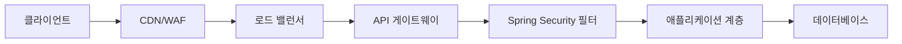

# 보안 가이드 v1.0.0 🛡️
**Girls Band Tabi - 보안 아키텍처 문서**

**최신 업데이트**: 2025년 11월 13일  
**버전**: v1.0.0  
**상태**: ✅ 최신  
**작성**: 보안 엔지니어링 팀  

## 목차

1. [보안 아키텍처 개요](#보안-아키텍처-개요)
2. [위협 모델](#위협-모델)
3. [인증 및 권한부여](#인증-및-권한부여)
4. [비밀번호 보안 및 시크릿 관리](#비밀번호-보안-및-시크릿-관리)
5. [API 보안 패턴](#api-보안-패턴)
6. [속도 제한 및 DDoS 보호](#속도-제한-및-ddos-보호)
7. [데이터 보호 및 개인정보 보호](#데이터-보호-및-개인정보-보호)
8. [보안 헤더 및 CORS 구성](#보안-헤더-및-cors-구성)
9. [감사 로깅 및 보안 모니터링](#감사-로깅-및-보안-모니터링)
10. [배포 보안](#배포-보안)
11. [보안 테스트 및 취약점 평가](#보안-테스트-및-취약점-평가)
12. [사고 대응 절차](#사고-대응-절차)
13. [구현 예제](#구현-예제)
14. [보안 체크리스트](#보안-체크리스트)

---

## 보안 아키텍처 개요

### 상위 수준 아키텍처

Girls Band Tabi 애플리케이션은 여러 계층을 가진 심층 방어 보안 전략을 구현합니다:


<details>
<summary>Mermaid 원본 코드 보기</summary>


</details>

**보안 계층:**

1. **네트워크 보안**: DDoS 보호 기능을 포함한 Cloudflare CDN
2. **전송 보안**: 모든 통신에 대한 TLS 1.3 암호화
3. **인증/권한부여**: 프로젝트 수준 RBAC를 포함한 JWT 기반 무상태 인증
4. **입력 검증**: 사용자 정의 정화 기능을 포함한 Bean Validation (JSR-380)
5. **속도 제한**: Redis 기반 분산 속도 제한
6. **감사 로깅**: 포괄적인 보안 이벤트 로깅
7. **데이터 보호**: 적절한 키 관리를 통한 민감한 데이터 암호화

### 핵심 보안 원칙

1. **제로 트러스트 아키텍처**: 절대 신뢰하지 않고, 항상 검증
2. **심층 방어**: 다중 보안 계층
3. **최소 권한 원칙**: 필요한 최소한의 접근 권한
4. **기본적으로 보안**: 기본적으로 활성화된 보안 기능
5. **안전한 실패**: 보안을 유지하면서 우아한 성능 저하

---

## 위협 모델

### 주요 위협

| 위협 | 영향도 | 가능성 | 완화 방법 |
|-----|--------|--------|----------|
| **인증 우회** | 높음 | 중간 | JWT 서명 검증, 짧은 토큰 만료 시간 |
| **SQL 인젝션** | 높음 | 낮음 | 매개변수화된 쿼리, JPA/R2DBC |
| **XSS/CSRF** | 중간 | 중간 | CSP 헤더, SameSite 쿠키 |
| **DDoS 공격** | 중간 | 높음 | 속도 제한, Cloudflare 보호 |
| **데이터 유출** | 높음 | 낮음 | 저장/전송 암호화, 접근 제어 |
| **권한 상승** | 높음 | 낮음 | RBAC, 메소드 수준 보안 |
| **세션 고정** | 중간 | 낮음 | 무상태 JWT 토큰 |
| **무차별 대입 공격** | 중간 | 중간 | 계정 잠금, 속도 제한 |

### 공격 벡터

1. **웹 애플리케이션**: REST API를 통한 주요 공격 표면
2. **인증**: JWT 토큰 탈취 또는 무차별 대입 공격
3. **데이터 계층**: SQL 인젝션 또는 무단 데이터 접근
4. **인프라스트럭처**: 컨테이너 탈출 또는 잘못된 구성
5. **공급망**: 종속성 취약점

### 신뢰 경계

- **공용 인터넷 ↔ CDN/WAF**: 신뢰할 수 없음에서 반신뢰로
- **CDN/WAF ↔ 애플리케이션**: 반신뢰에서 신뢰로
- **애플리케이션 ↔ 데이터베이스**: 신뢰할 수 있는 내부 통신
- **애플리케이션 ↔ 외부 API**: 신뢰하지만 검증됨

---

## 인증 및 권한부여

### JWT 토큰 시스템

**아키텍처:**
```kotlin
// Token Structure
{
  "header": {
    "alg": "HS256",
    "typ": "JWT"
  },
  "payload": {
    "sub": "user_id",
    "iss": "girlsbandtabi",
    "iat": 1699123456,
    "exp": 1699127056,
    "roles": ["USER"],
    "token_type": "access"
  }
}
```

**구현 세부사항:**

1. **토큰 유형:**
   - Access Token: 15분 수명, 사용자 역할 포함
   - Refresh Token: 7일 수명, 토큰 갱신용
   - Location Token: JWE 암호화된 위치 클레임

2. **보안 기능:**
   - 구성 가능한 비밀키로 HMAC-SHA256 서명
   - 짧은 만료 시간 윈도우
   - 자동 토큰 갱신 메커니즘
   - 리프레시 토큰 순환 (선택사항)

### 프로젝트 수준 권한부여

**역할 기반 접근 제어 (RBAC):**

```kotlin
// Project roles hierarchy
enum class ProjectRole {
    ADMIN,    // Full project management
    MODERATOR, // Content moderation
    MEMBER,   // Basic participation
    VIEWER    // Read-only access
}
```

**구현:**
```kotlin
@PreAuthorize("@projectAuth.isProjectAdmin(#projectCode)")
@PostMapping("/api/v1/projects/{projectCode}/admin")
fun adminAction(@PathVariable projectCode: String) {
    // Only project admins can access
}
```

### 보안 어노테이션

**메소드 보안:**
```kotlin
// Global role-based security
@PreAuthorize("hasRole('ADMIN')")
fun globalAdminAction() {}

// Project-specific security
@PreAuthorize("@projectAuth.isProjectAdmin(#projectId)")
fun projectAdminAction(@PathVariable projectId: String) {}

// Custom security expressions
@PreAuthorize("@securityService.canAccessResource(authentication.name, #resourceId)")
fun resourceAccess(@PathVariable resourceId: String) {}
```

### 현재 사용자 해석

**보안 사용자 컨텍스트:**
```kotlin
@Component
class CurrentUserResolver {
    fun authentication(): Authentication? = SecurityContextHolder.getContext().authentication
    
    fun optionalSubject(): String? = authentication()?.name
    
    fun optionalUserId(): UUID? = /* Extract from JWT claims */
    
    fun requiresSubject(): String = optionalSubject() 
        ?: throw SecurityException("Authentication required")
}
```

---

## 비밀번호 보안 및 시크릿 관리

### 향상된 비밀번호 보안

**PepperBCryptPasswordEncoder 구현:**

애플리케이션은 다층 비밀번호 보안 접근 방식을 사용합니다:

1. **글로벌 페퍼(Pepper)**: BCrypt 전에 적용되는 HMAC-SHA256 기반 페퍼
2. **BCrypt 해싱**: 구성 가능한 라운드 수 (기본값: 12)
3. **자동 업그레이드**: 로그인 시 레거시 비밀번호 업그레이드
4. **보안 검증**: 상수 시간 비교

**구성:**
```yaml
app:
  security:
    password:
      pepper: ${PASSWORD_PEPPER:__UNSAFE_DEFAULT__}
      bcrypt-strength: ${PASSWORD_BCRYPT_STRENGTH:12}
      pepper-enabled: ${PASSWORD_PEPPER_ENABLED:true}
```

**보안 기능:**
- 글로벌 페퍼를 통한 레인보우 테이블 공격 방지
- 미래 대비를 위한 구성 가능한 BCrypt 강도
- 페퍼가 없는 비밀번호와의 하위 호환성
- 로그인 시 자동 비밀번호 강도 업그레이드

### 시크릿 관리

**시크릿 검증:**
```kotlin
@Component
class SecretValidationRunner : ApplicationRunner {
    override fun run(args: ApplicationArguments) {
        validateSecrets()
    }
    
    private fun validateSecrets() {
        if (isProductionProfile() && isUnsafeDefault(jwtSecret)) {
            throw SecurityException("JWT secret must be configured for production")
        }
    }
}
```

**환경별 시크릿:**
- **개발**: 기본 시크릿으로 완화된 검증
- **프로덕션**: 필수 시크릿 검증, 기본값에서 빠른 실패
- **시크릿 소스**: 환경 변수, Vault, Kubernetes 시크릿

**모범 사례:**
1. 버전 관리에 시크릿을 절대 커밋하지 않기
2. 환경별로 다른 시크릿 사용
3. 시크릿을 정기적으로 순환
4. 시크릿 접근 및 사용 모니터링
5. 시크릿 관리 도구 사용 (HashiCorp Vault, AWS Secrets Manager)

---

## API 보안 패턴

### 입력 검증

**Bean Validation (JSR-380):**
```kotlin
data class CreateProjectRequest(
    @field:NotBlank
    @field:Size(min = 2, max = 100)
    val name: String,
    
    @field:Pattern(regexp = "^[a-z0-9-]+$")
    val slug: String,
    
    @field:Valid
    val settings: ProjectSettings?
)
```

**Custom Validation:**
```kotlin
@Component
class InputSanitizer {
    fun sanitizeHtml(input: String): String {
        return Jsoup.clean(input, Safelist.basicWithImages())
    }
    
    fun validateAndSanitize(input: String): String {
        require(input.length <= 10000) { "Input too long" }
        return sanitizeHtml(input)
    }
}
```

### 보안 헤더

**Comprehensive Security Headers:**
```kotlin
.headers { headers ->
    headers
        .frameOptions { it.deny() }                    // X-Frame-Options: DENY
        .contentTypeOptions { }                        // X-Content-Type-Options: nosniff
        .xssProtection { }                             // X-XSS-Protection: 1; mode=block
        .httpStrictTransportSecurity { hsts ->
            hsts.includeSubDomains(true)
                .maxAgeInSeconds(31536000)             // HSTS: 1 year
        }
}
```

### CORS 구성

**Secure CORS Setup:**
```kotlin
@Bean
fun corsConfigurationSource(): CorsConfigurationSource {
    val configuration = CorsConfiguration().apply {
        allowedOrigins = allowedOriginsList                // Whitelist specific origins
        allowedMethods = listOf("GET", "POST", "PUT", "DELETE", "PATCH", "OPTIONS")
        allowedHeaders = listOf("Authorization", "Content-Type", "Accept", "Origin", "X-Requested-With")
        exposedHeaders = listOf("Authorization", "Content-Type")
        allowCredentials = true                            // Enable credential sharing
        maxAge = 3600L                                     // Cache preflight for 1 hour
    }
    
    val source = UrlBasedCorsConfigurationSource()
    source.registerCorsConfiguration("/**", configuration)
    return source
}
```

### API 버전별 보안

**Version-Aware Security:**
```kotlin
// Different security rules per API version
.requestMatchers("/api/v1/**").hasRole("USER")
.requestMatchers("/api/v2/**").hasRole("VERIFIED_USER")
.requestMatchers("/api/admin/**").hasRole("ADMIN")
```

---

## 속도 제한 및 DDoS 방어

### Redis 기반 속도 제한

**다단계 속도 제한:**

1. **Global IP Limits**: 1000 requests/hour per IP
2. **API Endpoint Limits**: 100 requests/minute per IP per endpoint  
3. **Authentication Limits**: 5 login attempts per 15 minutes
4. **User-Specific Limits**: Per-user action quotas

**구현:**
```kotlin
@Component
@ConditionalOnProperty(prefix = "redis-features.rate-limiting", name = ["enabled"], havingValue = "true")
class RateLimitInterceptor(
    private val rateLimitRedisService: RateLimitRedisService,
    private val redisFeatureProperties: RedisFeatureProperties
) : HandlerInterceptor {
    
    override fun preHandle(request: HttpServletRequest, response: HttpServletResponse, handler: Any): Boolean {
        val clientIp = getClientIp(request)
        val requestUri = request.requestURI
        
        // Check if IP is blocked
        if (rateLimitRedisService.isIpBlocked(clientIp)) {
            response.status = HttpStatus.TOO_MANY_REQUESTS.value()
            response.writer.write("""{"error": "IP blocked due to rate limit violation"}""")
            return false
        }
        
        // Check global IP rate limit
        if (!rateLimitRedisService.checkIpRateLimit(
                clientIp,
                redisFeatureProperties.rateLimiting.globalIpLimit,
                redisFeatureProperties.rateLimiting.globalIpWindowHours
            )) {
            response.status = HttpStatus.TOO_MANY_REQUESTS.value()
            response.writer.write("""{"error": "Global IP rate limit exceeded"}""")
            return false
        }
        
        // Add rate limit headers
        addRateLimitHeaders(response, clientIp, requestUri)
        return true
    }
}
```

### DDoS 보호 전략

**3/4계층 보호:**
- Cloudflare DDoS 보호 (최대 100 Gbps)
- 자동 트래픽 필터링
- 지역 차단 기능

**7계층 보호:**
- IP/엔드포인트별 속도 제한
- 반복 가해자에 대한 점진적 지연
- 의심스러운 트래픽에 대한 CAPTCHA 챌린지
- 연결 제한

**Configuration:**
```yaml
redis-features:
  rate-limiting:
    enabled: true
    global-ip-limit: 1000
    global-ip-window-hours: 1
    api-limit: 100
    api-window-minutes: 1
    login-attempt-limit: 5
    login-window-minutes: 15
```

---

## 데이터 보호 및 프라이버시

### 저장 데이터 암호화

**데이터베이스 암호화:**
- PostgreSQL TDE (투명 데이터 암호화)
- 민감한 필드에 대한 애플리케이션 수준 암호화
- 암호화된 백업

**파일 저장소 암호화:**
- Cloudflare R2 서버 측 암호화
- 민감한 파일에 대한 클라이언트 측 암호화
- 암호화된 임시 파일 처리

### 전송 데이터 암호화

**TLS 구성:**
- TLS 1.3 최소 버전
- 완전 순방향 비밀성 (PFS)
- includeSubDomains와 함께 HSTS 헤더
- 인증서 피닝 (모바일 앱)

### 데이터 최소화

**프라이버시 바이 디자인:**
```kotlin
@Entity
data class UserEntity(
    val id: UUID,
    val username: String,
    val email: String,                    // Encrypted in database
    val passwordHash: String,             // BCrypt + pepper
    val lastLoginAt: OffsetDateTime?,
    val createdAt: OffsetDateTime = OffsetDateTime.now()
    // Note: No storage of unnecessary PII
)
```

**데이터 보존:**
- 만료된 토큰의 자동 삭제
- 계정 삭제 후 사용자 데이터 정리
- 감사 로그 보존 정책
- GDPR 준수 메커니즘

### 개인정보 처리

**GDPR 준수:**
1. **접근권**: 사용자 데이터 내보내기 기능
2. **정정권**: 프로필 업데이트 메커니즘
3. **삭제권**: 데이터 정리와 함께 계정 삭제
4. **데이터 이동성**: JSON 내보내기 형식
5. **동의 관리**: 세분화된 개인정보 설정

---

## 보안 헤더 및 CORS 구성

### 보안 헤더 구현

**완전한 헤더 보안:**
```kotlin
// In SecurityConfig.kt
.headers { headers ->
    headers
        .frameOptions { frame -> 
            frame.deny()                                    // Prevent clickjacking
        }
        .contentTypeOptions { }                             // Prevent MIME type sniffing
        .xssProtection { }                                  // Enable XSS filtering
        .httpStrictTransportSecurity { hsts ->
            hsts.includeSubDomains(true)
                .maxAgeInSeconds(31536000)                  // 1 year HSTS
        }
        .addHeaderWriter { request, response ->
            // Content Security Policy
            response.setHeader("Content-Security-Policy", 
                "default-src 'self'; script-src 'self' 'unsafe-inline'; style-src 'self' 'unsafe-inline'")
            
            // Additional security headers
            response.setHeader("X-Permitted-Cross-Domain-Policies", "none")
            response.setHeader("Referrer-Policy", "strict-origin-when-cross-origin")
            response.setHeader("Permissions-Policy", "camera=(), microphone=(), geolocation=(self)")
        }
}
```

### 쿠키 보안

**향상된 쿠키 구성:**
```yaml
app:
  security:
    cookie:
      secure: true                    # HTTPS only
      http-only: true                 # Prevent JavaScript access
      same-site: Lax                  # CSRF protection
      max-age: -1                     # Session cookies
      domain-pattern: ""              # Specific domain binding
      
      jwt:
        enabled: false                # JWT cookies disabled by default
        same-site: Strict             # Stricter for auth tokens
        http-only: true               # Essential for security
```

**쿠키 보안 필터:**
```kotlin
@Component
class CookieSecurityFilter : Filter {
    override fun doFilter(request: ServletRequest, response: ServletResponse, chain: FilterChain) {
        val wrapper = SecureCookieResponseWrapper(response as HttpServletResponse)
        chain.doFilter(request, wrapper)
    }
}

class SecureCookieResponseWrapper(response: HttpServletResponse) : HttpServletResponseWrapper(response) {
    override fun addCookie(cookie: Cookie) {
        cookie.secure = isSecureProfile()
        cookie.isHttpOnly = true
        cookie.path = cookie.path ?: "/"
        super.addCookie(cookie)
    }
}
```

### CORS 보안 모범 사례

**보안 CORS 구성:**
1. **특정 오리진**: 프로덕션에서 와일드카드(*) 피하기
2. **자격증명 처리**: allowCredentials 신중하게 활성화
3. **헤더 제한**: 허용/노출 헤더 제한
4. **메소드 제한**: 필요한 HTTP 메소드만 허용
5. **프리플라이트 캐싱**: 적절한 maxAge로 최적화

---

## 감사 로깅 및 보안 모니터링

### 구조화된 로깅 시스템

**다단계 로깅:**
```kotlin
@Service
class StructuredLogger {
    fun logSecurityEvent(
        eventType: SecurityEventType,
        description: String,
        userId: String? = null,
        ipAddress: String? = null,
        userAgent: String? = null,
        details: Map<String, Any> = emptyMap()
    ) {
        val securityEvent = SecurityEvent(
            timestamp = OffsetDateTime.now(),
            eventType = eventType.name,
            description = description,
            userId = userId,
            ipAddress = ipAddress,
            userAgent = userAgent,
            traceId = MDC.get("traceId"),
            details = details
        )
        
        securityLogger.info(objectMapper.writeValueAsString(securityEvent))
    }
}
```

**보안 이벤트 유형:**
```kotlin
enum class SecurityEventType {
    LOGIN_SUCCESS,
    LOGIN_FAILURE,
    LOGOUT,
    ACCESS_DENIED,
    RATE_LIMIT_EXCEEDED,
    SUSPICIOUS_ACTIVITY,
    TOKEN_VALIDATION_FAILURE,
    CSRF_ATTACK_DETECTED,
    SQL_INJECTION_ATTEMPT,
    XSS_ATTEMPT,
    FILE_UPLOAD_REJECTED
}
```

### 감사 추적 구현

**데이터베이스 감사 로깅:**
```kotlin
@Service
class AuditLogger {
    fun log(
        eventType: String,
        action: String,
        entityType: String? = null,
        entityId: String? = null,
        success: Boolean = true,
        failureReason: String? = null,
        responseStatus: Int? = null
    ) {
        val entity = AuditLogEntity(
            eventType = eventType,
            entityType = entityType,
            entityId = entityId,
            actorType = determineActorType(),
            actorId = currentUserResolver.optionalUserId(),
            subjectId = currentUserResolver.optionalSubject(),
            requestId = getRequestId(),
            ipAddress = getClientIp(),
            userAgent = getUserAgent(),
            action = action,
            resourcePath = getRequestURI(),
            responseStatus = responseStatus,
            success = success,
            failureReason = failureReason,
            createdAt = OffsetDateTime.now()
        )
        auditLogRepository.save(entity)
    }
}
```

### 요청 상관관계 및 추적

**상관관계 ID 필터:**
```kotlin
@Component
@Order(Ordered.HIGHEST_PRECEDENCE)
class LoggingFilter : Filter {
    override fun doFilter(request: ServletRequest, response: ServletResponse, chain: FilterChain) {
        val httpRequest = request as HttpServletRequest
        val httpResponse = response as HttpServletResponse
        
        val requestId = UUID.randomUUID().toString()
        val startTime = System.currentTimeMillis()
        
        try {
            // Set MDC context
            MDC.put("requestId", requestId)
            MDC.put("method", httpRequest.method)
            MDC.put("uri", httpRequest.requestURI)
            MDC.put("userAgent", httpRequest.getHeader("User-Agent") ?: "unknown")
            MDC.put("remoteAddr", getClientIpAddress(httpRequest))
            
            // Add correlation ID header
            httpRequest.getHeader("X-Correlation-ID")?.let { correlationId ->
                MDC.put("correlationId", correlationId)
                httpResponse.setHeader("X-Correlation-ID", correlationId)
            } ?: run {
                httpResponse.setHeader("X-Correlation-ID", requestId)
            }
            
            chain.doFilter(request, response)
        } finally {
            logRequestCompletion(httpRequest, httpResponse, startTime)
            MDC.clear()
        }
    }
}
```

### 보안 모니터링 알림

**실시간 보안 모니터링:**

1. **인증 실패 패턴**:
   - 동일 IP에서 여러 번 로그인 실패
   - 계정 열거 시도
   - 자격증명 스터핑 탐지

2. **의심스러운 활동 탐지**:
   - 비정상적인 접근 패턴
   - 권한 상승 시도
   - 데이터 유출 지표

3. **속도 제한 위반**:
   - IP 기반 속도 제한 위반
   - 사용자별 할당량 초과
   - API 남용 패턴

4. **보안 헤더 위반**:
   - CSP 정책 위반
   - CORS 정책 위반
   - 보안 헤더 누락

---

## 배포 보안

### 환경 구성

**환경별 시크릿 관리:**

**개발:**
```yaml
# application-local.yml
app:
  security:
    password:
      pepper: "__DEV_PEPPER__"    # Relaxed for development
jwt:
  secret: "__DEV_JWT_SECRET__"    # Simple secret for local testing
```

**프로덕션:**
```yaml
# application-prod.yml
app:
  security:
    password:
      pepper: ${PASSWORD_PEPPER}              # Must be provided via environment
      bcrypt-strength: 14                     # Higher strength for production
jwt:
  secret: ${JWT_SECRET}                       # Must be provided via environment
  access-token-expiration: 900                # 15 minutes
  refresh-token-expiration: 604800            # 7 days
```

**시크릿 검증:**
```kotlin
@Component
class SecretValidationRunner : ApplicationRunner {
    override fun run(args: ApplicationArguments) {
        if (!isLocalEnvironment() && isUnsafeSecret()) {
            throw SecurityException("Production deployment with unsafe defaults detected")
        }
    }
}
```

### 컨테이너 보안

**Dockerfile 보안 모범 사례:**
```dockerfile
# 특정 버전 태그 사용
FROM openjdk:17-jre-slim@sha256:specific-hash

# 비루트 사용자 생성
RUN addgroup --system app && adduser --system --group app

# 보안 권한 설정
COPY --chown=app:app target/app.jar app.jar

# 비루트로 실행
USER app

# 헬스 체크
HEALTHCHECK --interval=30s --timeout=3s --start-period=5s --retries=3 \
  CMD curl -f http://localhost:8080/actuator/health || exit 1

# 보안 시작
ENTRYPOINT ["java", "-XX:+UnlockExperimentalVMOptions", "-XX:+UseContainerSupport", "-jar", "app.jar"]
```

### 인프라스트럭처 보안

**네트워크 보안:**
- 프라이빗 서브넷이 있는 VPC
- 최소 접근 권한을 가진 보안 그룹
- 추가 필터링을 위한 네트워크 ACL
- 애플리케이션 보호를 위한 WAF 규칙

**데이터베이스 보안:**
- 암호화된 연결 (SSL/TLS)
- 데이터베이스 수준 암호화
- 정기적인 보안 패치
- 백업 암호화

**모니터링 및 알림:**
- CloudWatch/Prometheus 메트릭
- 로그 집계 (ELK 스택)
- 보안 이벤트 상관관계 분석
- 자동화된 사고 대응

---

## 보안 테스트 및 취약점 평가

### 자동화된 보안 테스트

**정적 코드 분석:**
```bash
# Detekt 보안 규칙
./gradlew detekt

# OWASP 종속성 검사
./gradlew dependencyCheck

# SpotBugs 보안 버그
./gradlew spotbugsMain
```

**동적 애플리케이션 보안 테스트 (DAST):**
```bash
# OWASP ZAP 자동화
zap-baseline.py -t http://localhost:8080 -g gen.conf

# 사용자 정의 보안 테스트 스위트
./gradlew securityTest
```

### 모의 해킹 체크리스트

**인증 테스트:**
- [ ] JWT 토큰 조작
- [ ] 세션 고정 시도
- [ ] 비밀번호 무차별 대입 저항성
- [ ] 다단계 인증 우회
- [ ] OAuth 플로우 보안

**권한부여 테스트:**
- [ ] 수평적 권한 상승
- [ ] 수직적 권한 상승  
- [ ] 직접 객체 참조 취약점
- [ ] 메소드 수준 보안 우회
- [ ] 프로젝트별 접근 제어

**입력 검증 테스트:**
- [ ] SQL 인젝션 시도
- [ ] XSS 페이로드 주입
- [ ] 명령 인젝션 테스트
- [ ] 경로 순회 시도
- [ ] 파일 업로드 보안

**API 보안 테스트:**
- [ ] 속도 제한 효과성
- [ ] CORS 정책 검증
- [ ] 보안 헤더 존재
- [ ] 오류 메시지 정보 누출
- [ ] API 버전별 보안

### 취약점 관리

**보안 패치 관리:**
1. **종속성 스캔**: 자동화된 일일 스캔
2. **CVE 모니터링**: 실시간 취약점 피드
3. **패치 우선순위**: CVSS 점수 기반 분류
4. **테스트 파이프라인**: 자동화된 보안 회귀 테스트
5. **배포**: 조정된 패치 롤아웃

**보안 메트릭:**
- 평균 탐지 시간 (MTTD)
- 평균 대응 시간 (MTTR)
- 취약점 노출 윈도우
- 보안 테스트 커버리지 백분율
- 거짓 양성/음성 비율

---

## 사고 대응 절차

### 보안 사고 분류

**심각도 수준:**

| Level | Description | Response Time | Escalation |
|-------|-------------|---------------|------------|
| **Critical** | Active data breach, system compromise | 15 minutes | CTO, CISO |
| **High** | Authentication bypass, privilege escalation | 1 hour | Security Lead |
| **Medium** | Rate limit violations, failed attacks | 4 hours | Dev Team |
| **Low** | Policy violations, suspicious activity | 24 hours | Monitoring |

### 사고 대응 플레이북

**데이터 유출 대응:**
1. **즉시 대응 (0-15분)**:
   - 영향받은 시스템 격리
   - 증거 및 로그 보존
   - 침해 범위 평가
   - 사고 지휘관에게 알림

2. **단기 대응 (15분 - 1시간)**:
   - 봉쇄 조치 구현
   - 악성 IP/계정 차단
   - 침해된 자격증명 순환
   - 사고 타임라인 문서화

3. **중기 대응 (1-24시간)**:
   - 포렌식 분석 수행
   - 데이터 노출 범위 평가
   - 고객 커뮤니케이션 준비
   - 추가 모니터링 구현

4. **장기 대응 (24시간 이상)**:
   - 사고 조사 완료
   - 보안 통제 업데이트
   - 교훈 학습 세션 수행
   - 필요시 규제 신고

### 커뮤니케이션 템플릿

**보안 알림 템플릿:**
```
SECURITY ALERT - [SEVERITY]

Incident ID: SEC-2024-001
Detection Time: 2024-11-12 14:30:00 UTC
Alert Source: [WAF/IDS/Manual]

Description:
[Brief description of security event]

Affected Systems:
- [List of impacted systems/services]

Actions Taken:
- [Immediate containment measures]

Next Steps:
- [Planned response activities]

Contact: security@girlsbandtabi.com
```

### 포렌식 및 증거 수집

**디지털 증거 처리:**
1. **로그 수집**: 불변 타임스탬프로 중앙 집중식 로깅
2. **메모리 덤프**: 시스템 상태 보존
3. **네트워크 캡처**: 트래픽 분석 기능
4. **데이터베이스 스냅샷**: 특정 시점 복구 옵션
5. **증거 관리 연속성**: 문서화된 증거 처리

**준수 보고:**
- GDPR 침해 신고 (72시간)
- PCI DSS 사고 보고
- SOC 2 사고 문서화
- 고객 알림 절차

---

## 구현 예시

### 보안 컨트롤러 구현

```kotlin
@RestController
@RequestMapping("/api/v1/projects")
@PreAuthorize("isAuthenticated()")
class ProjectController(
    private val projectService: ProjectService,
    private val auditLogger: AuditLogger,
    private val structuredLogger: StructuredLogger
) {
    
    @PostMapping
    @PreAuthorize("hasRole('USER')")
    fun createProject(@Valid @RequestBody request: CreateProjectRequest): ProjectResponse {
        val startTime = System.currentTimeMillis()
        return try {
            val project = projectService.createProject(request)
            
            auditLogger.log(
                eventType = "PROJECT",
                action = "CREATE",
                entityType = "Project",
                entityId = project.id.toString(),
                success = true
            )
            
            structuredLogger.logBusinessEvent(
                eventType = "PROJECT_CREATED",
                description = "New project created: ${project.name}",
                metadata = mapOf("projectId" to project.id.toString())
            )
            
            project.toResponse()
        } catch (e: Exception) {
            structuredLogger.logSecurityEvent(
                eventType = SecurityEventType.SUSPICIOUS_ACTIVITY,
                description = "Project creation failed: ${e.message}",
                details = mapOf("error" to e.javaClass.simpleName)
            )
            throw e
        } finally {
            val duration = System.currentTimeMillis() - startTime
            structuredLogger.logPerformanceMetric("create_project", duration, true)
        }
    }
    
    @PutMapping("/{projectId}")
    @PreAuthorize("@projectAuth.isProjectAdmin(#projectId)")
    fun updateProject(
        @PathVariable projectId: String,
        @Valid @RequestBody request: UpdateProjectRequest
    ): ProjectResponse {
        // Implementation with similar security patterns
    }
}
```

### 보안 서비스 구현

```kotlin
@Service
@Transactional
class ProjectService(
    private val projectRepository: ProjectRepository,
    private val currentUserResolver: CurrentUserResolver,
    private val inputSanitizer: InputSanitizer
) {
    
    fun createProject(request: CreateProjectRequest): Project {
        // Input validation and sanitization
        val sanitizedName = inputSanitizer.sanitizeHtml(request.name)
        val sanitizedDescription = request.description?.let { 
            inputSanitizer.sanitizeHtml(it) 
        }
        
        // Authorization check
        val currentUser = currentUserResolver.requiresSubject()
        
        // Business logic with security controls
        val project = Project(
            name = sanitizedName,
            description = sanitizedDescription,
            slug = generateSecureSlug(request.slug),
            ownerId = currentUserResolver.requiresUserId(),
            createdBy = currentUser
        )
        
        return projectRepository.save(project)
    }
    
    private fun generateSecureSlug(proposedSlug: String): String {
        // Ensure slug meets security requirements
        val sanitized = proposedSlug.lowercase()
            .replace(Regex("[^a-z0-9-]"), "")
            .take(50)
            
        if (sanitized.length < 2) {
            throw ValidationException("Slug must be at least 2 characters")
        }
        
        return sanitized
    }
}
```

### 보안 이벤트 처리

```kotlin
@Component
class SecurityEventHandler {
    
    @EventListener
    fun handleAuthenticationFailure(event: AuthenticationFailureBadCredentialsEvent) {
        structuredLogger.logSecurityEvent(
            eventType = SecurityEventType.LOGIN_FAILURE,
            description = "Authentication failed for user: ${event.authentication.name}",
            userId = event.authentication.name,
            ipAddress = getClientIp(),
            userAgent = getUserAgent(),
            details = mapOf("reason" to "bad_credentials")
        )
        
        // Implement account lockout logic
        authenticationAttemptService.recordFailure(event.authentication.name, getClientIp())
    }
    
    @EventListener
    fun handleAccessDenied(event: AuthorizationDeniedEvent) {
        structuredLogger.logSecurityEvent(
            eventType = SecurityEventType.ACCESS_DENIED,
            description = "Access denied to resource: ${event.resource}",
            userId = event.authentication.name,
            details = mapOf(
                "resource" to event.resource,
                "requiredAuthority" to event.requiredAuthority
            )
        )
    }
}
```

---

## 보안 체크리스트

### 개발 보안 체크리스트

**인증 및 권한부여:**
- [ ] JWT 토큰 적절한 검증
- [ ] 토큰 만료 시간 적절한 구성
- [ ] 리프레시 토큰 순환 구현
- [ ] 메소드 수준 보안 어노테이션 적용
- [ ] 프로젝트 수준 권한부여 구현
- [ ] 현재 사용자 컨텍스트 적절한 해석

**입력 검증:**
- [ ] 모든 입력 DTO에 Bean Validation 어노테이션
- [ ] 사용자 콘텐츠 HTML 정화
- [ ] SQL 인젝션 방지 (매개변수화된 쿼리)
- [ ] 경로 순회 방지
- [ ] 파일 업로드 검증
- [ ] 요청 크기 제한 강제

**비밀번호 보안:**
- [ ] 적절한 강도의 BCrypt (≥12)
- [ ] 글로벌 페퍼 구현
- [ ] 비밀번호 업그레이드 메커니즘
- [ ] 실패 시도 후 계정 잠금
- [ ] 강력한 비밀번호 정책

**API 보안:**
- [ ] 속도 제한 구성
- [ ] CORS 정책 적절한 제한
- [ ] 보안 헤더 구현
- [ ] 오류 메시지가 정보 누출하지 않음
- [ ] API 버전별 보안 적용
- [ ] 감사용 요청/응답 로깅

### 배포 보안 체크리스트

**환경 구성:**
- [ ] 프로덕션 시크릿 적절한 구성
- [ ] 기본/안전하지 않은 시크릿 검증
- [ ] 환경별 구성
- [ ] 시크릿 순환 절차 문서화
- [ ] 시크릿 접근 적절한 제한

**인프라스트럭처 보안:**
- [ ] TLS 1.3 구성
- [ ] 인증서 검증
- [ ] 네트워크 보안 그룹 구성
- [ ] 데이터베이스 암호화 활성화
- [ ] 백업 암호화 활성화
- [ ] 컨테이너 비루트로 실행

**모니터링 및 로깅:**
- [ ] 보안 이벤트 로깅 활성화
- [ ] 감사 추적 구현
- [ ] 성능 모니터링
- [ ] 오류 추적 구성
- [ ] 보안 알림 구성
- [ ] 사고 대응 절차 문서화

### 프로덕션 준비 체크리스트

**보안 구성:**
- [ ] 모든 보안 기능 활성화
- [ ] 프로덕션 로드에 맞는 속도 제한 구성
- [ ] CORS 정책 충분히 제한적
- [ ] 보안 헤더 적절한 구성
- [ ] 쿠키 보안 설정 적용
- [ ] JWT 구성 강화

**운영 보안:**
- [ ] 보안 모니터링 알림 구성
- [ ] 로그 집계 설정
- [ ] 사고 대응 팀 식별
- [ ] 백업 및 복구 절차 테스트
- [ ] 모의 해킹 완료
- [ ] 취약점 평가 수행

**준수 및 문서화:**
- [ ] 보안 문서 업데이트
- [ ] 개인정보 정책 검토
- [ ] 서비스 약관에 보안 조항 포함
- [ ] 데이터 보존 정책 구현
- [ ] GDPR 준수 확인
- [ ] 보안 교육 완료

---

## 결론

이 보안 문서는 Girls Band Tabi 애플리케이션의 보안 태세를 유지하고 향상시키기 위한 포괄적인 지침을 제공합니다. 진화하는 위협에 대응하고 강력한 보호를 유지하기 위해서는 이러한 보안 조치의 정기적인 검토와 업데이트가 필수적입니다.

질문이나 보안 문제가 있으시면 security@girlsbandtabi.com으로 보안팀에 문의하세요.

**최종 업데이트:** 2025-11-13  
**다음 검토:** 2026-02-13  
**문서 담당자:** 보안 엔지니어링 팀