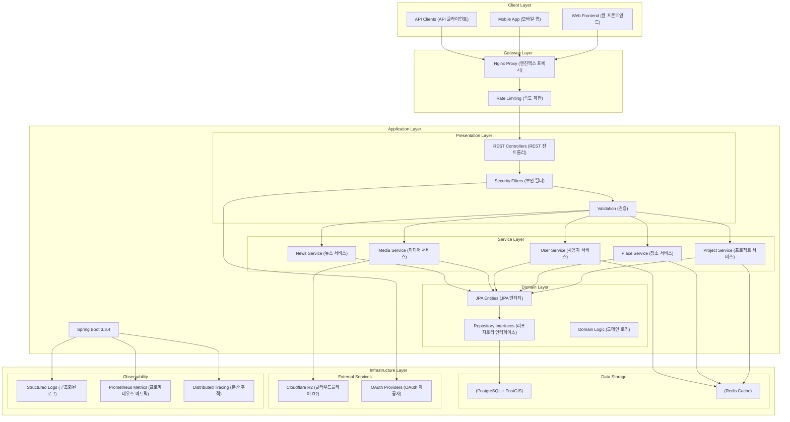

# 시스템 아키텍처 문서 v1.0.0 🏛️
**Girls Band Tabi - 기술 아키텍처 가이드**

**최신 업데이트**: 2025년 11월 13일  
**버전**: v1.0.0  
**상태**: ✅ 최신  

> 걸즈밴드타비 프로젝트의 포괄적인 기술 아키텍처 문서

## 목차

1. [개요](#개요)
2. [기술 스택](#기술-스택)
3. [시스템 아키텍처](#시스템-아키텍처)
4. [모듈 구조와 경계](#모듈-구조와-경계)
5. [도메인 주도 설계 패턴](#도메인-주도-설계-패턴)
6. [서비스 레이어 아키텍처](#서비스-레이어-아키텍처)
7. [데이터 흐름과 처리](#데이터-흐름과-처리)
8. [통합 패턴](#통합-패턴)
9. [공간 데이터 아키텍처](#공간-데이터-아키텍처)
10. [캐싱 전략](#캐싱-전략)
11. [이벤트 기반 패턴](#이벤트-기반-패턴)
12. [보안 아키텍처](#보안-아키텍처)
13. [확장성 고려사항](#확장성-고려사항)
14. [배포 패턴](#배포-패턴)
15. [미래 발전 로드맵](#미래-발전-로드맵)

---

## 개요

Girls Band Tabi는 애니메이션과 음악 팬을 위한 **위치 기반 성지순례 플랫폼**으로, **Spring Boot 3.x**와 **Spring MVC + JPA** 스택을 사용하여 구축되었습니다. 이 시스템은 다양한 밴드 프랜차이즈(Girls Band Cry, BanG Dream! 등)를 위한 멀티 프로젝트 아키텍처를 정교한 공간정보 기능과 함께 지원합니다.

### 핵심 비즈니스 도메인
- **사용자 관리**: 인증, 프로필, 역할 기반 접근 제어
- **프로젝트 관리**: 멀티 밴드 프랜차이즈 지원
- **공간정보 서비스**: 위치 검증, 성지순례 사이트
- **콘텐츠 관리**: 뉴스, 미디어, 라이브 이벤트
- **커뮤니티 기능**: 게시물, 댓글, 즐겨찾기
- **분석**: 방문 추적, 사용자 인사이트

### 아키텍처 원칙
1. **캡슐화**: 최소한의 결합도를 가진 명확한 모듈 경계
2. **관심사의 분리**: 프레젠테이션, 비즈니스, 영속성을 위한 구별된 레이어
3. **확장성**: 새로운 기능을 위한 플러그인 기반 아키텍처
4. **보안 우선**: 인증, 권한 부여, 감사 로깅
5. **성능**: 캐싱 전략, 쿼리 최적화, 공간 인덱싱

---

## 기술 스택

### 핵심 프레임워크 스택
```yaml
Framework: Spring Boot 3.3.4
Language: Kotlin 2.0.21
JVM: OpenJDK 21
Architecture: Spring MVC (blocking) + JPA
```

### 데이터베이스 및 영속성
```yaml
Primary Database: PostgreSQL 15 with PostGIS 3.3
ORM: Hibernate 6.x with Spatial Support (공간정보 지원)
Connection Pool: HikariCP
Migration Tool: Flyway 10.18.0
Spatial Library: JTS (Java Topology Suite)
```

### 캐싱 및 성능
```yaml
L1 Cache: Caffeine (in-memory, 메모리 내 캐시)
L2 Cache: Redis 7 (distributed, 분산 캐시)
Session Store: Redis
Cache Manager: Spring Cache Abstraction
```

### 보안 및 인증
```yaml
Framework: Spring Security 6.x
JWT Library: JJWT 0.12.6
OAuth2: Google, Apple providers
Password Hashing: BCrypt with pepper
Session Management: Redis-backed
```

### 외부 통합
```yaml
File Storage: Cloudflare R2 (S3-compatible)
Observability: Micrometer + Prometheus
Documentation: SpringDoc OpenAPI 3.1
Build Tool: Gradle 8.x with Kotlin DSL
```

### 개발 및 품질
```yaml
Code Style: Google Style Guide (Kotlin/Java)
Linting: KTLint + Detekt
Testing: JUnit 5 + Testcontainers
Container: Docker with multi-stage builds
```

---

## 시스템 아키텍처

### 고수준 아키텍처 다이어그램


<details>
<summary>Mermaid 원본 코드 보기</summary>



<!-- 전체 시스템 아키텍처 구조 -->


<!-- 호환성을 위한 PNG 버전 -->


</details>

### 현재 구현: MVC + JPA 스택

시스템은 현재 JPA와 함께 **블로킹 MVC 아키텍처**를 사용하여 다음을 제공합니다:
- **일관성**: 단일 스레드 모델로 추론이 간단함
- **안정성**: 광범위한 도구를 갖춘 성숙한 Spring 생태계
- **성능**: 캐싱 최적화로 현재 규모에 충분
- **개발자 경험**: 익숙한 패턴, 광범위한 문서

**아키텍처 결정**: 프로젝트는 원래 WebFlux + R2DBC를 계획했지만 다음 이유로 MVC + JPA로 마이그레이션했습니다:
1. **단순성**: 더 쉬운 디버깅과 문제 해결
2. **생태계 성숙도**: 더 나은 라이브러리 지원과 커뮤니티 리소스
3. **공간정보 지원**: Hibernate Spatial과의 완전한 PostGIS 통합
4. **팀 친숙도**: 기여자들의 학습 곡선 감소

---

## 모듈 구조와 경계

### 패키지 구조 (현재 구현)

```
org.pyrimidines.girlsbandtabi/
├── config/                    # 구성 빈
│   ├── SecurityConfig         # 보안 및 인증
│   ├── CacheConfig           # 캐싱 전략
│   ├── OpenApiConfig         # API 문서화
│   └── WebMvcConfig          # 웹 레이어 구성
│
├── gateway/rest/             # REST API 엔드포인트
│   ├── ProjectController     # 프로젝트 관리
│   ├── PlaceController       # 공간정보 작업
│   ├── UserController        # 사용자 프로필
│   ├── MediaController       # 파일 업로드/다운로드
│   └── admin/                # 관리자 엔드포인트
│
├── service/                  # 비즈니스 로직 레이어
│   ├── ProjectService        # 프로젝트 작업
│   ├── PlaceService          # 공간 쿼리
│   ├── UserService           # 사용자 관리
│   ├── MediaService          # 파일 처리
│   └── CacheEvictionService  # 캐시 관리
│
├── persistence/              # 데이터 접근 레이어
│   ├── entity/              # JPA 엔티티
│   │   ├── PlaceEntity       # 공간 데이터 모델
│   │   ├── UserEntity        # 사용자 프로필
│   │   └── ProjectEntity     # 프로젝트 메타데이터
│   └── repo/                # 리포지토리 인터페이스
│       ├── PlaceRepository   # 공간 쿼리
│       ├── UserRepository    # 사용자 데이터 접근
│       └── ProjectRepository # 프로젝트 작업
│
├── dto/                     # 데이터 전송 객체
│   ├── project/             # 프로젝트 관련 DTO
│   ├── place/               # 위치 DTO
│   ├── user/                # 사용자 DTO
│   └── common/              # 공유 응답 타입
│
├── security/                # 보안 프레임워크
│   ├── JwtService           # 토큰 관리
│   ├── CurrentUserResolver  # 사용자 컨텍스트
│   └── project/             # 프로젝트 레벨 권한 부여
│
└── exception/               # 예외 처리
    ├── GlobalExceptionHandler
    └── 도메인별 예외
```

### 미래 Modulith 경계

더 나은 캡슐화를 위한 **Spring Modulith 마이그레이션 계획**:

```
modules/
├── user/                    # 사용자 관리 모듈
│   ├── application/         # 사용 사례 및 서비스
│   ├── domain/             # 핵심 비즈니스 로직
│   └── infrastructure/     # 데이터 접근, 외부 서비스
│
├── project/                # 프로젝트 관리 모듈
│   ├── application/
│   ├── domain/
│   └── infrastructure/
│
├── place/                  # 공간정보 모듈
│   ├── application/
│   ├── domain/
│   └── infrastructure/
│
├── media/                  # 콘텐츠 관리 모듈
│   ├── application/
│   ├── domain/
│   └── infrastructure/
│
└── shared/                 # 공유 커널
    ├── domain/             # 공통 값 객체
    ├── infrastructure/     # 공유 유틸리티
    └── events/             # 도메인 이벤트
```

**모듈 통신 규칙**:
- **내부**: 모듈 경계 내에서 직접 메서드 호출
- **모듈 간**: 이벤트 또는 잘 정의된 서비스 인터페이스
- **외부**: 서드파티 통합을 위한 어댑터 패턴

---

## 도메인 주도 설계 패턴

### 도메인 모델 아키텍처

시스템은 풍부한 도메인 엔티티를 가진 **DDD 전술 패턴**을 따릅니다:

#### 애그리게이트 루트
```kotlin
// 예시: Place 애그리게이트
@Entity
class PlaceEntity(
    val id: UUID,
    val projectId: UUID,
    val name: String,
    val location: Point,  // PostGIS 공간 타입
    val verificationRadiusM: Int = 10,
    // ... 도메인 로직 메서드
) {
    // 도메인 행동
    fun isWithinVerificationRadius(userLocation: Point): Boolean
    fun associateWithUnit(unitId: UUID)
    fun normalizedPlaceTypes(): List<String>
}
```

#### 값 객체 (Value Objects)
```kotlin
// 검증이 포함된 공간 좌표
data class Coordinates(val latitude: Double, val longitude: Double) {
    init {
        require(latitude in -90.0..90.0) { "Invalid latitude" }
        require(longitude in -180.0..180.0) { "Invalid longitude" }
    }
}

// 조작 방지 검증이 포함된 위치 요청
data class LocationClaim(
    val coordinates: Coordinates,
    val accuracy: Double,
    val timestamp: OffsetDateTime,
    val deviceId: String?
)
```

#### 리포지토리 패턴
```kotlin
interface PlaceRepository : JpaRepository<PlaceEntity, UUID> {
    // 네이티브 PostGIS 함수를 사용한 공간 쿼리
    @Query("""
        SELECT p FROM PlaceEntity p 
        WHERE ST_DWithin(p.location, ST_Point(:longitude, :latitude, 4326), :radiusM)
        AND p.isActive = true
    """)
    fun findWithinRadius(
        latitude: Double, 
        longitude: Double, 
        radiusM: Double
    ): List<PlaceEntity>
    
    // 배열 연산을 사용한 프로젝트 범위 쿼리
    @Query("""
        SELECT p FROM PlaceEntity p 
        WHERE :projectId = ANY(p.projectIds) 
        AND p.isActive = true
    """)
    fun findByProjectId(projectId: UUID): List<PlaceEntity>
}
```

### 도메인 이벤트 (미래 개선사항)

느슨한 결합을 위한 **이벤트 기반 아키텍처 계획**:

```kotlin
// 모듈 간 통신을 위한 도메인 이벤트
sealed class DomainEvent {
    abstract val aggregateId: UUID
    abstract val occurredOn: OffsetDateTime
}

data class PlaceVisitedEvent(
    override val aggregateId: UUID,
    override val occurredOn: OffsetDateTime,
    val userId: UUID,
    val placeId: UUID,
    val verificationMethod: String
) : DomainEvent()

data class UserRegisteredEvent(
    override val aggregateId: UUID,
    override val occurredOn: OffsetDateTime,
    val email: String,
    val displayName: String
) : DomainEvent()
```

---

## 서비스 레이어 아키텍처

### 서비스 설계 원칙

1. **단일 책임**: 각 서비스는 하나의 도메인 영역을 관리
2. **트랜잭션 경계**: 서비스가 트랜잭션 범위를 정의
3. **캐싱 통합**: 성능을 위한 전략적 캐시 사용
4. **오류 처리**: 일관된 예외 변환

### 서비스 구현 예시

```kotlin
@Service
@Transactional(readOnly = true)
class PlaceService(
    private val placeRepository: PlaceRepository,
    private val placeImageRepository: PlaceImageRepository,
    private val regionService: RegionService,
    private val cacheManager: CacheManager
) {
    
    @Cacheable("place:detail", key = "#placeId")
    fun getPlaceWithImages(placeId: UUID): PlaceDetailDto {
        val place = placeRepository.findByIdOrThrow(placeId)
        
        // N+1 쿼리를 피하기 위한 애플리케이션 관리 관계
        place.images = placeImageRepository.findByPlaceId(placeId).toMutableList()
        place.region = regionService.findByCode(place.regionCode)
        
        return place.toDetailDto()
    }
    
    @Transactional
    @CacheEvict("place:list", allEntries = true)
    fun createPlace(request: CreatePlaceRequest): PlaceDto {
        val place = PlaceEntity(
            projectId = request.projectId,
            name = request.name,
            location = geometryFactory.createPoint(
                Coordinate(request.longitude, request.latitude)
            ),
            verificationRadiusM = request.verificationRadius ?: 10
        )
        
        return placeRepository.save(place).toDto()
    }
    
    // 캐싱이 포함된 공간 쿼리
    @Cacheable("place:geo-bounds")
    fun findPlacesInBounds(
        bounds: GeoBounds,
        projectIds: List<UUID>
    ): List<PlaceSummaryDto> {
        return placeRepository.findInBoundsWithProjects(
            bounds.southwest.latitude, bounds.southwest.longitude,
            bounds.northeast.latitude, bounds.northeast.longitude,
            projectIds
        ).map { it.toSummaryDto() }
    }
}
```

### 서비스 레이어의 장점

- **트랜잭션 관리**: Spring을 통한 자동 트랜잭션 처리
- **캐시 통합**: 제거 전략이 포함된 선언적 캐싱
- **검증**: 서비스 경계에서의 Bean Validation 통합
- **오류 변환**: 리포지토리 예외를 도메인 예외로 변환
- **성능 최적화**: 쿼리 배치 처리 및 관계 관리

---

## 데이터 흐름과 처리 패턴

### 요청 처리 흐름


<details>
<summary>Mermaid 원본 코드 보기</summary>

```mermaid
sequenceDiagram
    participant Client %% EN: Client / KO: 클라이언트
    participant Controller %% EN: Controller / KO: 컨트롤러
    participant Validator %% EN: Validator / KO: 검증자
    participant Service %% EN: Service / KO: 서비스
    participant Repository %% EN: Repository / KO: 리포지토리
    participant Database %% EN: Database / KO: 데이터베이스
    participant Cache %% EN: Cache / KO: 캐시
    
    Client->>Controller: HTTP Request %% EN: HTTP Request / KO: HTTP 요청
    Controller->>Validator: Validate Request %% EN: Validate Request / KO: 요청 검증
    Validator->>Service: Process Business Logic %% EN: Process Business Logic / KO: 비즈니스 로직 처리
    Service->>Cache: Check Cache %% EN: Check Cache / KO: 캐시 확인
    alt Cache Hit %% EN: Cache Hit / KO: 캐시 히트
        Cache-->>Service: Return Cached Data %% EN: Return Cached Data / KO: 캐시된 데이터 반환
    else Cache Miss %% EN: Cache Miss / KO: 캐시 미스
        Service->>Repository: Query Database %% EN: Query Database / KO: 데이터베이스 조회
        Repository->>Database: Execute SQL %% EN: Execute SQL / KO: SQL 실행
        Database-->>Repository: Return Results %% EN: Return Results / KO: 결과 반환
        Repository-->>Service: Entity Objects %% EN: Entity Objects / KO: 엔티티 객체
        Service->>Cache: Store in Cache %% EN: Store in Cache / KO: 캐시에 저장
    end
    Service-->>Controller: Return DTO %% EN: Return DTO / KO: DTO 반환
    Controller-->>Client: HTTP Response %% EN: HTTP Response / KO: HTTP 응답
```

<!-- 데이터 처리 시퀀스 플로우 -->


<!-- 호환성을 위한 PNG 버전 -->


</details>

### 데이터 변환 레이어

1. **HTTP → DTO**: 요청 바인딩 및 검증
2. **DTO → Entity**: 비즈니스 로직 적용
3. **Entity → Database**: JPA 영속성
4. **Database → Entity**: 쿼리 결과 매핑
5. **Entity → DTO**: 응답 직렬화

### 공간 데이터 처리

```kotlin
// 예시: 공간 쿼리 처리 흐름
fun processLocationVerification(claim: LocationClaim): VerificationResult {
    // 1. 요청 구조 검증 및 조작 방지 확인
    validateLocationClaim(claim)
    
    // 2. PostGIS 지오메트리로 변환
    val userPoint = geometryFactory.createPoint(
        Coordinate(claim.coordinates.longitude, claim.coordinates.latitude)
    )
    
    // 3. 거리 계산을 포함한 공간 쿼리
    val nearbyPlaces = placeRepository.findWithinRadius(
        claim.coordinates.latitude,
        claim.coordinates.longitude,
        radiusMeters = 50.0
    )
    
    // 4. 검증을 위한 비즈니스 로직
    val verifiedPlace = nearbyPlaces.firstOrNull { place ->
        place.isWithinVerificationRadius(userPoint) &&
        place.isActive &&
        !isRecentlyVisited(claim.userId, place.id)
    }
    
    // 5. 구조화된 결과 반환
    return VerificationResult(
        success = verifiedPlace != null,
        placeId = verifiedPlace?.id,
        distance = verifiedPlace?.let { 
            ST_Distance(userPoint, it.location) 
        }
    )
}
```

---

## 통합 패턴

### 외부 서비스 통합 아키텍처

#### Cloudflare R2 통합 (파일 스토리지)

```kotlin
@Configuration
class R2Config {
    @Bean
    fun s3Client(@Value("\${r2.access-key-id}") accessKey: String): S3Client {
        return S3Client.builder()
            .endpointOverride(URI.create("https://\${r2.account-id}.r2.cloudflarestorage.com"))
            .credentialsProvider(StaticCredentialsProvider.create(
                AwsBasicCredentials.create(accessKey, secretKey)
            ))
            .region(Region.AUTO)
            .build()
    }
}

@Service
class MediaService(private val s3Client: S3Client) {
    
    fun generatePresignedUploadUrl(filename: String): PresignedUploadUrl {
        val presignRequest = PutObjectPresignRequest.builder()
            .signatureDuration(Duration.ofMinutes(15))
            .putObjectRequest(PutObjectRequest.builder()
                .bucket(bucketName)
                .key("uploads/$filename")
                .contentType("image/jpeg")
                .build())
            .build()
            
        val presignedRequest = s3Presigner.presignPutObject(presignRequest)
        
        return PresignedUploadUrl(
            url = presignedRequest.url().toString(),
            fields = presignedRequest.signedHeaders(),
            expiresAt = OffsetDateTime.now().plus(Duration.ofMinutes(15))
        )
    }
}
```

#### OAuth 통합 (인증)

```kotlin
@Configuration
@EnableOAuth2Client
class SecurityConfig {
    
    @Bean
    fun oauth2UserService(): OAuth2UserService<OAuth2UserRequest, OAuth2User> {
        return DefaultOAuth2UserService().let { delegate ->
            OAuth2UserService { userRequest ->
                val oAuth2User = delegate.loadUser(userRequest)
                
                // EN: Custom user mapping logic
        // KO: 사용자 정의 사용자 매핑 로직
                val registrationId = userRequest.clientRegistration.registrationId
                val userAttributes = when (registrationId) {
                    "google" -> GoogleUserAttributes(oAuth2User.attributes)
                    "apple" -> AppleUserAttributes(oAuth2User.attributes)
                    else -> throw IllegalArgumentException("Unknown provider: $registrationId") // EN: Unknown provider / KO: 알 수 없는 제공자
                }
                
                // EN: Create or update user in our system
                // KO: 시스템에서 사용자 생성 또는 업데이트
                userService.createOrUpdateFromOAuth(userAttributes)
                
                DefaultOAuth2User(
                    setOf(SimpleGrantedAuthority("ROLE_USER")),
                    oAuth2User.attributes,
                    "sub"
                )
            }
        }
    }
}
```

### 부패 방지 레이어

**Pattern (패턴)**: Protect domain model from external service changes (외부 서비스 변경으로부터 도메인 모델 보호)

```kotlin
// EN: Anti-corruption layer for OAuth providers
// KO: OAuth 제공자를 위한 부패 방지 레이어
interface UserProfileProvider {
    fun extractUserProfile(attributes: Map<String, Any>): ExternalUserProfile
}

class GoogleUserProfileProvider : UserProfileProvider {
    override fun extractUserProfile(attributes: Map<String, Any>): ExternalUserProfile {
        return ExternalUserProfile(
            externalId = attributes["sub"] as String,
            email = attributes["email"] as String,
            displayName = attributes["name"] as String,
            avatarUrl = attributes["picture"] as String?,
            emailVerified = attributes["email_verified"] as Boolean? ?: false
        )
    }
}

class AppleUserProfileProvider : UserProfileProvider {
    override fun extractUserProfile(attributes: Map<String, Any>): ExternalUserProfile {
        // EN: Apple-specific attribute mapping
        // KO: Apple 고유 속성 매핑
        val email = attributes["email"] as String
        val name = (attributes["name"] as Map<String, String>?)?.let {
            "${it["firstName"]} ${it["lastName"]}"
        } ?: email.substringBefore("@")
        
        return ExternalUserProfile(
            externalId = attributes["sub"] as String,
            email = email,
            displayName = name,
            avatarUrl = null, // EN: Apple doesn't provide profile pictures / KO: Apple은 프로필 사진을 제공하지 않음
            emailVerified = true // EN: Apple emails are pre-verified / KO: Apple 이메일은 사전 검증됨
        )
    }
}
```

### 서킷 브레이커 패턴

```kotlin
@Component
class ResilientExternalService {
    
    @CircuitBreaker(name = "cloudflare-r2", fallbackMethod = "uploadFallback")
    @TimeLimiter(name = "cloudflare-r2")
    fun uploadFile(file: MultipartFile): CompletableFuture<String> {
        return CompletableFuture.supplyAsync {
            s3Client.putObject(
                PutObjectRequest.builder()
                    .bucket(bucketName)
                    .key(generateKey(file))
                    .build(),
                RequestBody.fromInputStream(file.inputStream, file.size)
            ).eTag()
        }
    }
    
    fun uploadFallback(file: MultipartFile, ex: Exception): CompletableFuture<String> {
        logger.warn("Upload failed, using fallback", ex) // EN: Upload failed, using fallback / KO: 업로드 실패, 대체 방법 사용
        return CompletableFuture.completedFuture("fallback-url")
    }
}
```

---

## PostGIS를 활용한 공간 데이터 아키텍처

### PostGIS 공간 확장

이 시스템은 고급 공간 연산을 위해 **PostGIS**를 활용합니다:

```sql
-- EN: Enable PostGIS extensions
-- KO: PostGIS 확장 기능 활성화
CREATE EXTENSION IF NOT EXISTS postgis;
CREATE EXTENSION IF NOT EXISTS postgis_topology;

-- EN: Spatial data types and indexes
-- KO: 공간 데이터 타입 및 인덱스
CREATE TABLE places (
    id UUID PRIMARY KEY,
    name VARCHAR(200) NOT NULL,
    location geography(Point, 4326) NOT NULL,  -- EN: WGS84 coordinate system / KO: WGS84 좌표계
    verification_radius_m INTEGER DEFAULT 10,
    project_ids UUID[] NOT NULL,
    unit_ids UUID[] NOT NULL,
    is_active BOOLEAN DEFAULT true,
    created_at TIMESTAMPTZ DEFAULT NOW()
);

-- EN: Spatial indexes for performance
-- KO: 성능을 위한 공간 인덱스
CREATE INDEX idx_places_location_gist ON places USING GIST(location);
CREATE INDEX idx_places_project_ids_gin ON places USING GIN(project_ids);
CREATE INDEX idx_places_is_active ON places (is_active) WHERE is_active = true;

-- EN: Composite spatial + business logic index
-- KO: 복합 공간 + 비즈니스 로직 인덱스
CREATE INDEX idx_places_active_location ON places 
USING GIST(location) WHERE is_active = true;
```

### 공간 쿼리 패턴

#### 거리 기반 쿼리
```kotlin
// EN: Find places within radius using PostGIS ST_DWithin
// KO: PostGIS ST_DWithin을 사용하여 반경 내 장소 찾기
@Query("""
    SELECT p, ST_Distance(p.location, ST_Point(:longitude, :latitude, 4326)) as distance
    FROM PlaceEntity p 
    WHERE ST_DWithin(p.location, ST_Point(:longitude, :latitude, 4326), :radiusM)
    AND p.isActive = true
    ORDER BY ST_Distance(p.location, ST_Point(:longitude, :latitude, 4326))
    """)
fun findNearbyPlacesWithDistance(
    latitude: Double, 
    longitude: Double, 
    radiusM: Double
): List<Pair<PlaceEntity, Double>>
```

#### 경계 박스 쿼리
```kotlin
// EN: Efficient viewport queries using bounding box
// KO: 경계 박스를 사용한 효율적인 뷰포트 쿼리
@Query("""
    SELECT p FROM PlaceEntity p 
    WHERE p.location && ST_MakeEnvelope(:minX, :minY, :maxX, :maxY, 4326)
    AND p.isActive = true
    AND (:projectIds IS NULL OR p.projectIds && CAST(:projectIds AS UUID[]))
    """)
fun findInBounds(
    minX: Double, minY: Double, 
    maxX: Double, maxY: Double,
    projectIds: List<UUID>?
): List<PlaceEntity>
```

#### 공간 집계
```sql
-- EN: Region-based place clustering
-- KO: 지역 기반 장소 클러스터링
SELECT 
    region_code,
    COUNT(*) as place_count,
    ST_Centroid(ST_Union(location)) as center_point,
    ST_Extent(location) as bounding_box
FROM places 
WHERE is_active = true 
GROUP BY region_code;
```

### 공간 데이터 무결성

#### 조작 방지 검증
```kotlin
data class LocationClaim(
    val coordinates: Coordinates,
    val accuracy: Double,
    val timestamp: OffsetDateTime,
    val deviceSignature: String?
) {
    fun validateAntiTamper(previousClaim: LocationClaim?): ValidationResult {
        // EN: Speed check: detect impossible movement
        // KO: 속도 확인: 불가능한 이동 감지
        previousClaim?.let { prev ->
            val distance = calculateDistance(prev.coordinates, this.coordinates)
            val timeDiff = Duration.between(prev.timestamp, this.timestamp).seconds
            val speedMps = distance / timeDiff
            
            if (speedMps > MAX_HUMAN_SPEED_MPS) {
                return ValidationResult.invalid("Impossible movement speed: ${speedMps}m/s") // EN: Impossible movement speed / KO: 불가능한 이동 속도
            }
        }
        
        // EN: Accuracy validation
        // KO: 정확도 검증
        if (accuracy > MAX_ACCURACY_THRESHOLD) {
            return ValidationResult.invalid("GPS accuracy too poor: ${accuracy}m") // EN: GPS accuracy too poor / KO: GPS 정확도가 너무 낮음
        }
        
        // Time validation (prevent replay attacks)
        val ageSeconds = Duration.between(timestamp, OffsetDateTime.now()).seconds
        if (ageSeconds > MAX_CLAIM_AGE_SECONDS) {
            return ValidationResult.invalid("Location claim too old: ${ageSeconds}s")
        }
        
        return ValidationResult.valid()
    }
}
```

### 성능 최적화

#### 공간 인덱스 전략
1. **GIST 인덱스**: 지오메트리 컬럼을 위한 기본 공간 인덱스입니다.
2. **부분 인덱스**: 활성 상태의 장소만 인덱싱해 성능을 높입니다.
3. **복합 인덱스**: 공간 조건과 비즈니스 로직 필터를 결합합니다.
4. **배열 인덱스**: 프로젝트/유닛 ID 필터링을 위한 GIN 인덱스를 사용합니다.

#### 쿼리 최적화
```kotlin
// Optimized service method with caching and efficient queries
@Cacheable("place:nearby", key = "#latitude + ',' + #longitude + ',' + #radiusKm")
fun findNearbyPlaces(
    latitude: Double, 
    longitude: Double, 
    radiusKm: Double = 1.0,
    projectIds: List<UUID>? = null,
    limit: Int = 50
): List<PlaceSummaryDto> {
    
    // Use smaller radius first for initial filtering
    val radiusM = radiusKm * 1000
    
    // Efficient spatial query with business logic filters
    return placeRepository.findNearbyWithFilters(
        latitude, longitude, radiusM, projectIds, limit
    ).map { (place, distance) ->
        PlaceSummaryDto(
            id = place.id,
            name = place.name,
            distance = distance,
            coordinates = Coordinates(
                place.location.y, // latitude
                place.location.x  // longitude
            )
        )
    }
}
```

---

## 캐싱 전략

### 다단계 캐싱 아키텍처

이 시스템은 다음과 같은 **정교한 2계층 캐싱 전략**을 구현합니다:

```
┌─────────────────────────────────────────────────┐
│                Application                      │
├─────────────────────────────────────────────────┤
│          L1: Caffeine (Local Cache)             │
│  • Ultra-fast memory cache (초고속 메모리 캐시)                 │
│  • 1000 entries max, 1h TTL (최대 1000개 항목, 1시간 TTL)          │
│  • Method-level caching (메소드 수준 캐시)                      │
├─────────────────────────────────────────────────┤
│           L2: Redis (Distributed)               │
│  • Shared across instances (인스턴스 간 공유)                      │
│  • Session storage (세션 저장소)                               │
│  • Rate limiting counters (속도 제한 카운터)                      │
│  • Token blacklisting (토큰 블랙리스트)                           │
├─────────────────────────────────────────────────┤
│              PostgreSQL                         │
└─────────────────────────────────────────────────┘
```

### 캐싱 설정

```kotlin
@Configuration
@EnableCaching
class CacheConfig {
    
    @Bean
    @Primary
    fun caffeineCacheManager(): CacheManager {
        return CaffeineCache.newBuilder()
            .maximumSize(1000)
            .expireAfterWrite(1, TimeUnit.HOURS)
            .recordStats()
            .buildCacheManager()
    }
    
    @Bean
    fun redisCacheManager(
        redisConnectionFactory: RedisConnectionFactory
    ): RedisCacheManager {
        return RedisCacheManager.builder(redisConnectionFactory)
            .cacheDefaults(
                RedisCacheConfiguration.defaultCacheConfig()
                    .entryTtl(Duration.ofHours(2))
                    .serializeKeysWith(StringRedisSerializer())
                    .serializeValuesWith(GenericJackson2JsonRedisSerializer())
            )
            .build()
    }
}
```

### 캐시 사용 패턴

#### Read-Through 캐싱
```kotlin
@Service
class PlaceService {
    
    // EN: L1 cache for frequently accessed place details
    // KO: 자주 액세스되는 장소 세부정보를 위한 L1 캐시
    @Cacheable("place:detail", key = "#placeId")
    fun getPlaceDetail(placeId: UUID): PlaceDetailDto {
        val place = placeRepository.findByIdOrThrow(placeId)
        // EN: Populate relationships efficiently
        // KO: 효율적으로 관계 데이터 채우기
        place.images = placeImageRepository.findByPlaceId(placeId).toMutableList()
        return place.toDetailDto()
    }
    
    // EN: Spatial queries with coordinate-based cache keys
    // KO: 좌표 기반 캐시 키를 사용하는 공간 쿼리
    @Cacheable("place:nearby", key = "#lat + ',' + #lng + ',' + #radius")
    fun findNearbyPlaces(lat: Double, lng: Double, radius: Double): List<PlaceDto> {
        return placeRepository.findWithinRadius(lat, lng, radius)
            .map { it.toDto() }
    }
}
```

#### 캐시 제거가 포함된 Write-Through
```kotlin
@Service
class PlaceService {
    
    @Transactional
    @CacheEvict(value = ["place:detail", "place:nearby"], key = "#placeId")
    fun updatePlace(placeId: UUID, request: UpdatePlaceRequest): PlaceDto {
        val place = placeRepository.findByIdOrThrow(placeId)
        place.apply {
            name = request.name
            description = request.description
            verificationRadiusM = request.verificationRadius
        }
        return placeRepository.save(place).toDto()
    }
    
    // EN: Batch cache eviction for complex operations
    // KO: 복잡한 작업을 위한 일괄 캐시 제거
    @CacheEvict(value = ["place:list"], allEntries = true)
    fun bulkImportPlaces(places: List<CreatePlaceRequest>): List<PlaceDto> {
        // EN: Bulk operation that affects list queries
        // KO: 목록 쿼리에 영향을 주는 일괄 작업
        return placeRepository.saveAll(places.map { it.toEntity() })
            .map { it.toDto() }
    }
}
```

#### 세션 및 토큰 관리
```kotlin
@Service
class TokenRedisService(private val redisTemplate: RedisTemplate<String, String>) {
    
    fun blacklistToken(token: String, expirySeconds: Long) {
        redisTemplate.opsForValue().set(
            "blacklist:$token", 
            "revoked",
            Duration.ofSeconds(expirySeconds)
        )
    }
    
    fun isTokenBlacklisted(token: String): Boolean {
        return redisTemplate.hasKey("blacklist:$token")
    }
    
    // EN: Rate limiting with Redis counters
    // KO: Redis 카운터를 사용한 속도 제한
    fun incrementRateLimit(key: String, windowSeconds: Long): Long {
        val redisKey = "rate_limit:$key"
        return redisTemplate.opsForValue().increment(redisKey)?.also {
            if (it == 1L) {
                redisTemplate.expire(redisKey, Duration.ofSeconds(windowSeconds))
            }
        } ?: 0L
    }
}
```

### 캐시 성능 모니터링

```kotlin
@Component
class CacheMetrics {
    
    @EventListener
    fun handleCacheHit(event: CacheHitEvent) {
        meterRegistry.counter("cache.hit", "name", event.cacheName).increment()
    }
    
    @EventListener
    fun handleCacheMiss(event: CacheMissEvent) {
        meterRegistry.counter("cache.miss", "name", event.cacheName).increment()
    }
    
    @Scheduled(fixedRate = 60000) // EN: Every minute / KO: 매분
    fun reportCacheStatistics() {
        cacheManager.cacheNames.forEach { cacheName ->
            val cache = cacheManager.getCache(cacheName) as CaffeineCache?
            cache?.nativeCache?.stats()?.let { stats ->
                meterRegistry.gauge("cache.size", cacheName, stats.requestCount())
                meterRegistry.gauge("cache.hit_rate", cacheName, stats.hitRate())
                meterRegistry.gauge("cache.eviction_count", cacheName, stats.evictionCount())
            }
        }
    }
}
```

### 캐시 무효화 전략

1. **시간 기반 TTL**: 대부분의 캐시 데이터에 자동 만료를 적용합니다.
2. **이벤트 기반**: 데이터 변경 시 수동으로 캐시를 제거합니다.
3. **버전 기반**: 일관성을 위해 캐시 키에 버전 번호를 포함합니다.
4. **계단식 제거**: 연관된 캐시 항목을 함께 무효화합니다.

**Cache Key Design Patterns (캐시 키 디자인 패턴)**:
- **Hierarchical (계층적)**: `user:profile:${userId}` for organized invalidation (조직적 무효화를 위해)
- **Composite (복합)**: `place:nearby:${lat},${lng},${radius}` for spatial queries (공간 쿼리를 위해)
- **Versioned (버전 관리)**: `project:${id}:v${version}` for consistency (일관성을 위해)

---

## 이벤트 기반 패턴

### 현재 상태: 동기 처리

현재 시스템은 **동기 요청-응답 패턴**으로 동작하지만 향후 이벤트 기반 확장을 위해 설계되어 있습니다:

```kotlin
// EN: Current synchronous approach
// KO: 현재의 동기 방식
@Service
class PlaceVisitService {
    
    @Transactional
    fun recordVisit(userId: UUID, placeId: UUID, locationClaim: LocationClaim): VisitResult {
        // EN: Validate location claim
        // KO: 위치 클레임 검증
        val validation = validateLocationClaim(locationClaim, placeId)
        if (!validation.isValid) {
            return VisitResult.invalid(validation.reason)
        }
        
        // EN: Record visit synchronously
        // KO: 동기적으로 방문 기록
        val visitEvent = VisitEventEntity(
            userId = userId,
            placeId = placeId,
            location = locationClaim.toPoint(),
            verificationMethod = "gps",
            accuracy = locationClaim.accuracy
        )
        visitEventRepository.save(visitEvent)
        
        // EN: Update user statistics synchronously
        // KO: 동기적으로 사용자 통계 업데이트
        userStatsService.incrementVisitCount(userId)
        
        // EN: Update place popularity synchronously
        // KO: 동기적으로 장소 인기도 업데이트
        placeStatsService.incrementVisitCount(placeId)
        
        return VisitResult.success(visitEvent.id)
    }
}
```

### 계획된 이벤트 기반 아키텍처

**Future enhancement with Spring Modulith events (Spring Modulith 이벤트로 미래 향상)**:

```kotlin
// EN: Domain events for decoupled processing
// KO: 분리된 처리를 위한 도메인 이벤트
sealed class DomainEvent {
    abstract val aggregateId: UUID
    abstract val occurredOn: OffsetDateTime
    abstract val eventId: UUID
}

data class PlaceVisitedEvent(
    override val aggregateId: UUID, // placeId
    override val occurredOn: OffsetDateTime,
    override val eventId: UUID = UUID.randomUUID(),
    val userId: UUID,
    val location: Point,
    val verificationAccuracy: Double
) : DomainEvent()

// Event-driven service with async processing
@Service
class PlaceVisitService {
    
    @Transactional
    @Async("visitProcessingExecutor")
    fun recordVisit(userId: UUID, placeId: UUID, locationClaim: LocationClaim): VisitResult {
        // EN: Core visit recording (synchronous)
        // KO: 핵심 방문 기록 (동기)
        val validation = validateLocationClaim(locationClaim, placeId)
        if (!validation.isValid) {
            return VisitResult.invalid(validation.reason)
        }
        
        val visitEvent = visitEventRepository.save(
            VisitEventEntity(userId, placeId, locationClaim.toPoint())
        )
        
        // EN: Emit domain event for async processing
        // KO: 비동기 처리를 위한 도메인 이벤트 발생
        applicationEventPublisher.publishEvent(
            PlaceVisitedEvent(
                aggregateId = placeId,
                occurredOn = OffsetDateTime.now(),
                userId = userId,
                location = locationClaim.toPoint(),
                verificationAccuracy = locationClaim.accuracy
            )
        )
        
        return VisitResult.success(visitEvent.id)
    }
}

// EN: Async event handlers
// KO: 비동기 이벤트 핸들러
@Component
class PlaceEventHandlers {
    
    @EventListener
    @Async("statisticsExecutor")
    fun handlePlaceVisited(event: PlaceVisitedEvent) {
        // EN: Update place popularity statistics
        // KO: 장소 인기도 통계 업데이트
        placeStatsService.incrementVisitCount(event.aggregateId)
        
        // EN: Update regional statistics
        // KO: 지역 통계 업데이트
        regionStatsService.incrementVisitCount(
            placeService.getRegionCode(event.aggregateId)
        )
    }
    
    @EventListener
    @Async("userStatsExecutor")
    fun updateUserStatistics(event: PlaceVisitedEvent) {
        // EN: Update user visit count
        // KO: 사용자 방문 횟수 업데이트
        userStatsService.incrementVisitCount(event.userId)
        
        // EN: Check for achievements/milestones
        // KO: 달성/마일스톤 확인
        achievementService.checkVisitMilestones(event.userId)
        
        // EN: Update user ranking if applicable
        // KO: 해당되는 경우 사용자 순위 업데이트
        rankingService.updateUserRanking(event.userId)
    }
    
    @EventListener
    @Async("notificationExecutor")
    fun sendNotifications(event: PlaceVisitedEvent) {
        // EN: Notify followers of user activity
        // KO: 사용자 활동을 팔로워들에게 알림
        notificationService.notifyFollowers(
            event.userId, 
            "Visited ${placeService.getPlaceName(event.aggregateId)}"
        )
        
        // EN: Check for group challenges
        // KO: 그룹 챌린지 확인
        challengeService.updateGroupProgress(event.userId, event.aggregateId)
    }
}
```

### 이벤트 스토어 설계 (향후)

```kotlin
// EN: Event sourcing pattern for audit and replay capability
// KO: 감사 및 재생 기능을 위한 이벤트 소싱 패턴
@Entity
@Table(name = "domain_events")
data class StoredDomainEvent(
    @Id val eventId: UUID = UUID.randomUUID(),
    val aggregateId: UUID,
    val eventType: String,
    @Column(columnDefinition = "jsonb")
    val eventData: String,
    val eventVersion: Int,
    val occurredOn: OffsetDateTime = OffsetDateTime.now(),
    val processedAt: OffsetDateTime? = null
)

@Repository
interface DomainEventStore : JpaRepository<StoredDomainEvent, UUID> {
    
    @Query("SELECT e FROM StoredDomainEvent e WHERE e.aggregateId = :aggregateId ORDER BY e.eventVersion")
    fun findByAggregateIdOrderByVersion(aggregateId: UUID): List<StoredDomainEvent>
    
    @Query("SELECT e FROM StoredDomainEvent e WHERE e.processedAt IS NULL ORDER BY e.occurredOn")
    fun findUnprocessedEvents(): List<StoredDomainEvent>
}
```

### 이벤트 기반 아키텍처의 이점

1. **결합도 감소**: 서비스 간 직접 호출 대신 이벤트를 통해 통신합니다.
2. **확장성 향상**: 비동기 처리가 응답 시간을 단축합니다.
3. **복원력 확보**: 실패한 이벤트 처리는 독립적으로 재시도할 수 있습니다.
4. **추적 가능성**: 디버깅과 컴플라이언스를 위한 완전한 이벤트 이력을 확보합니다.
5. **유연성 강화**: 신규 기능이 기존 이벤트를 구독하여 쉽게 확장할 수 있습니다.

---

## 보안 아키텍처

### 다층 보안 프레임워크


<details>
<summary>Mermaid 원본 코드 보기</summary>

```mermaid
graph TD
    subgraph "Security Layers" %% EN: Security Layers / KO: 보안 레이어
        A["Transport Security<br/>HTTPS/TLS 1.3"] %% EN: Transport Security / KO: 전송 보안
        B["API Gateway<br/>Rate Limiting"] %% EN: API Gateway Rate Limiting / KO: API 게이트웨이 속도 제한
        C["Authentication<br/>JWT + OAuth2"] %% EN: Authentication / KO: 인증
        D["Authorization<br/>RBAC + Method Security"] %% EN: Authorization / KO: 권한 부여
        E["Input Validation<br/>Bean Validation"] %% EN: Input Validation / KO: 입력 검증
        F["Data Protection<br/>Encryption + Hashing"] %% EN: Data Protection / KO: 데이터 보호
        G["Audit Logging<br/>Security Events"] %% EN: Audit Logging / KO: 감사 로깅
    end
    
    A --> B --> C --> D --> E --> F --> G
```

<!-- 보안 계층 구조 -->


<!-- 호환성을 위한 PNG 버전 -->


</details>

### 인증 및 권한 부여

#### JWT 토큰 관리
```kotlin
@Component
class JwtService(
    @Value("\${jwt.secret}") private val secret: String,
    @Value("\${jwt.access-token-expiration}") private val accessExpiration: Long,
    @Value("\${jwt.refresh-token-expiration}") private val refreshExpiration: Long
) {
    
    private val accessKey: SecretKey = Keys.hmacShaKeyFor(secret.toByteArray())
    
    fun generateAccessToken(user: UserEntity): String {
        return Jwts.builder()
            .setSubject(user.id.toString())
            .claim("role", user.role)
            .claim("email", user.email)
            .setIssuedAt(Date())
            .setExpiration(Date(System.currentTimeMillis() + accessExpiration * 1000))
            .signWith(accessKey)
            .compact()
    }
    
    fun validateToken(token: String): JwtValidationResult {
        return try {
            // EN: Check token blacklist first
            // KO: 먼저 토큰 블랙리스트 확인
            if (tokenRedisService.isTokenBlacklisted(token)) {
                return JwtValidationResult.invalid("Token has been revoked") // EN: Token has been revoked / KO: 토큰이 취소됨
            }
            
            val claims = Jwts.parserBuilder()
                .setSigningKey(accessKey)
                .build()
                .parseClaimsJws(token)
                .body
            
            JwtValidationResult.valid(claims)
        } catch (ex: ExpiredJwtException) {
            JwtValidationResult.invalid("Token expired") // EN: Token expired / KO: 토큰 만료
        } catch (ex: JwtException) {
            JwtValidationResult.invalid("Invalid token") // EN: Invalid token / KO: 유효하지 않은 토큰
        }
    }
}
```

#### 역할 기반 접근 제어
```kotlin
@Configuration
@EnableGlobalMethodSecurity(prePostEnabled = true)
class SecurityConfig {
    
    @Bean
    fun securityFilterChain(http: HttpSecurity): SecurityFilterChain {
        return http
            .csrf { it.disable() }
            .sessionManagement { it.sessionCreationPolicy(SessionCreationPolicy.STATELESS) }
            .authorizeHttpRequests { authz ->
                authz
                    // EN: Public endpoints
                    // KO: 공개 엔드포인트
                    .requestMatchers("/api/v1/auth/**").permitAll()
                    .requestMatchers("/api/v1/projects/*/places").permitAll()
                    
                    // EN: User endpoints
                    // KO: 사용자 엔드포인트
                    .requestMatchers("/api/v1/users/**").hasRole("USER")
                    .requestMatchers("/api/v1/places/*/visits").hasRole("USER")
                    
                    // EN: Admin endpoints
                    // KO: 관리자 엔드포인트
                    .requestMatchers("/api/v1/admin/**").hasRole("ADMIN")
                    
                    // EN: Default authenticated
                    // KO: 기본 인증 필요
                    .anyRequest().authenticated()
            }
            .oauth2Login { oauth2 ->
                oauth2
                    .userInfoEndpoint { it.userService(customOAuth2UserService) }
                    .successHandler(oauth2SuccessHandler)
            }
            .addFilterBefore(jwtAuthenticationFilter, UsernamePasswordAuthenticationFilter::class.java)
            .build()
    }
}

// EN: Method-level security
// KO: 메소드 수준 보안
@Service
class PlaceService {
    
    @PreAuthorize("@projectRoleService.hasRole(authentication.name, #projectId, 'EDITOR')")
    fun updatePlace(projectId: UUID, placeId: UUID, request: UpdatePlaceRequest): PlaceDto {
        // EN: Implementation
        // KO: 구현
    }
    
    @PostAuthorize("@placeSecurityService.canViewPlace(returnObject, authentication)")
    fun getPlaceDetail(placeId: UUID): PlaceDetailDto {
        // EN: Implementation
        // KO: 구현
    }
}
```

#### 프로젝트 레벨 권한 부여
```kotlin
@Component
class ProjectRoleService(
    private val projectRoleRepository: ProjectRoleRepository
) {
    
    fun hasRole(userSubject: String, projectId: UUID, requiredRole: String): Boolean {
        val userRoles = projectRoleRepository.findActiveRolesByUserAndProject(userSubject, projectId)
        return userRoles.any { it.role >= ProjectRole.valueOf(requiredRole) }
    }
    
    fun getUserProjectRoles(userSubject: String): Map<UUID, Set<ProjectRole>> {
        return projectRoleRepository.findActiveRolesByUser(userSubject)
            .groupBy({ it.projectId }, { it.role })
            .mapValues { it.value.toSet() }
    }
}

enum class ProjectRole {
    VIEWER, EDITOR, ADMIN;
    
    operator fun compareTo(other: ProjectRole): Int {
        return this.ordinal.compareTo(other.ordinal)
    }
}
```

### 입력 검증 및 정제

```kotlin
// EN: Request DTOs with validation
// KO: 검증이 포함된 요청 DTO
data class CreatePlaceRequest(
    @field:NotBlank
    @field:Size(min = 1, max = 200)
    val name: String,
    
    @field:Valid
    val coordinates: CoordinatesDto,
    
    @field:Min(1)
    @field:Max(1000)
    val verificationRadius: Int = 10,
    
    @field:Pattern(regexp = "^[a-zA-Z0-9_-]+$")
    val placeType: String = "unknown"
)

data class CoordinatesDto(
    @field:DecimalMin("-90.0")
    @field:DecimalMax("90.0")
    val latitude: Double,
    
    @field:DecimalMin("-180.0")
    @field:DecimalMax("180.0")
    val longitude: Double
) {
    // EN: Custom validation for location tampering
    // KO: 위치 조작에 대한 사용자 정의 검증
    @AssertTrue(message = "Invalid coordinate precision")
    fun isValidPrecision(): Boolean {
        // EN: Prevent overly precise coordinates (potential tampering)
        // KO: 지나치게 정확한 좌표 방지 (조작 가능성)
        val latPrecision = latitude.toString().substringAfter(".").length
        val lngPrecision = longitude.toString().substringAfter(".").length
        return latPrecision <= 8 && lngPrecision <= 8
    }
}
```

### 데이터 보호

#### 패스워드 보안
```kotlin
@Component
class PasswordService(
    @Value("\${app.security.password.pepper}") private val pepper: String,
    @Value("\${app.security.password.bcrypt-strength}") private val strength: Int
) {
    
    private val bcryptEncoder = BCryptPasswordEncoder(strength)
    
    fun hashPassword(rawPassword: String): String {
        // EN: Add pepper for additional security layer
        // KO: 추가 보안 레이어를 위한 pepper 추가
        val pepperedPassword = rawPassword + pepper
        return bcryptEncoder.encode(pepperedPassword)
    }
    
    fun verifyPassword(rawPassword: String, hashedPassword: String): Boolean {
        val pepperedPassword = rawPassword + pepper
        return bcryptEncoder.matches(pepperedPassword, hashedPassword)
    }
}
```

#### 민감 데이터 암호화
```kotlin
@Component
class DataEncryptionService {
    
    @Value("\${encryption.key}")
    private lateinit var encryptionKey: String
    
    private val cipher = Cipher.getInstance("AES/GCM/NoPadding")
    private val secretKey by lazy { 
        SecretKeySpec(encryptionKey.toByteArray(), "AES") 
    }
    
    fun encrypt(data: String): String {
        cipher.init(Cipher.ENCRYPT_MODE, secretKey)
        val encryptedData = cipher.doFinal(data.toByteArray())
        val iv = cipher.iv
        return Base64.getEncoder().encodeToString(iv + encryptedData)
    }
    
    fun decrypt(encryptedData: String): String {
        val decoded = Base64.getDecoder().decode(encryptedData)
        val iv = decoded.sliceArray(0..11) // EN: GCM IV is 12 bytes / KO: GCM IV는 12바이트
        val cipherText = decoded.sliceArray(12 until decoded.size)
        
        val gcmSpec = GCMParameterSpec(128, iv)
        cipher.init(Cipher.DECRYPT_MODE, secretKey, gcmSpec)
        
        return String(cipher.doFinal(cipherText))
    }
}
```

### 감사 로깅 및 보안 모니터링

```kotlin
@Entity
@Table(name = "audit_logs")
data class AuditLogEntity(
    @Id val id: UUID = UUID.randomUUID(),
    val userId: UUID?,
    val userSubject: String?,
    val action: String,
    val resourceType: String,
    val resourceId: UUID?,
    @Column(columnDefinition = "jsonb")
    val details: String?,
    val ipAddress: String?,
    val userAgent: String?,
    val success: Boolean,
    val timestamp: OffsetDateTime = OffsetDateTime.now()
)

@Component
class SecurityAuditService(
    private val auditLogRepository: AuditLogRepository
) {
    
    fun logSecurityEvent(
        action: String,
        userId: UUID? = null,
        resourceType: String,
        resourceId: UUID? = null,
        success: Boolean = true,
        details: Any? = null,
        request: HttpServletRequest? = null
    ) {
        val auditLog = AuditLogEntity(
            userId = userId,
            userSubject = SecurityContextHolder.getContext().authentication?.name,
            action = action,
            resourceType = resourceType,
            resourceId = resourceId,
            details = details?.let { objectMapper.writeValueAsString(it) },
            ipAddress = request?.getClientIpAddress(),
            userAgent = request?.getHeader("User-Agent"),
            success = success
        )
        
        auditLogRepository.save(auditLog)
    }
    
    @EventListener
    fun handleAuthenticationSuccess(event: AuthenticationSuccessEvent) {
        logSecurityEvent(
            action = "AUTHENTICATION_SUCCESS",
            resourceType = "USER"
        )
    }
    
    @EventListener
    fun handleAuthenticationFailure(event: AbstractAuthenticationFailureEvent) {
        logSecurityEvent(
            action = "AUTHENTICATION_FAILURE",
            resourceType = "USER",
            success = false,
            details = mapOf("reason" to event.exception.message)
        )
    }
}
```

---

## 확장성 고려 사항

### 수평 확장 아키텍처


<details>
<summary>Mermaid 원본 코드 보기</summary>

```mermaid
graph TB
    subgraph "Load Balancer Layer" %% EN: Load Balancer Layer / KO: 로드밸런서 레이어
        LB["Nginx Load Balancer<br/>SSL Termination"] %% EN: SSL Termination / KO: SSL 종료
    end
    
    subgraph "Application Layer("Stateless")" %% EN: Application Layer Stateless / KO: 애플리케이션 레이어("무상태")
        APP1["App Instance 1<br/>Spring Boot"] %% EN: App Instance / KO: 앱 인스턴스
        APP2["App Instance 2<br/>Spring Boot"] %% EN: App Instance / KO: 앱 인스턴스
        APP3["App Instance N<br/>Spring Boot"] %% EN: App Instance / KO: 앱 인스턴스
    end
    
    subgraph "Caching Layer" %% EN: Caching Layer / KO: 캐시 레이어
        REDIS1["(Redis Primary)"] %% EN: Redis Primary / KO: Redis 주 서버
        REDIS2["(Redis Replica)"] %% EN: Redis Replica / KO: Redis 복제 서버
    end
    
    subgraph "Database Layer" %% EN: Database Layer / KO: 데이터베이스 레이어
        PG_PRIMARY["(PostgreSQL Primary<br/>Write/Read)"] %% EN: Write/Read / KO: 쓰기/읽기
        PG_REPLICA1["(PostgreSQL Replica 1<br/>Read Only)"] %% EN: Read Only / KO: 읽기 전용
        PG_REPLICA2["(PostgreSQL Replica N<br/>Read Only)"] %% EN: Read Only / KO: 읽기 전용
    end
    
    subgraph "Storage Layer" %% EN: Storage Layer / KO: 저장소 레이어
        R2["Cloudflare R2<br/>Global CDN"] %% EN: Global CDN / KO: 전역 CDN
    end
    
    LB --> APP1
    LB --> APP2 
    LB --> APP3
    
    APP1 --> REDIS1
    APP2 --> REDIS1
    APP3 --> REDIS1
    
    REDIS1 --> REDIS2
    
    APP1 --> PG_PRIMARY
    APP2 --> PG_PRIMARY
    APP3 --> PG_PRIMARY
    
    APP1 --> PG_REPLICA1
    APP2 --> PG_REPLICA1
    APP3 --> PG_REPLICA2
    
    APP1 --> R2
    APP2 --> R2
    APP3 --> R2
```

<!-- 확장성 및 로드밸런싱 구조 -->


<!-- 호환성을 위한 PNG 버전 -->


</details>

### 데이터베이스 확장 전략

#### 부하 분산이 포함된 읽기 레플리카
```kotlin
@Configuration
class DatabaseConfig {
    
    @Bean
    @Primary
    fun primaryDataSource(): DataSource {
        return HikariDataSource().apply {
            jdbcUrl = "jdbc:postgresql://primary-db:5432/girlsbandtabi"
            username = "app_user"
            password = "secure_password"
            maximumPoolSize = 20
            minimumIdle = 5
            connectionTimeout = 30000
            idleTimeout = 600000
            maxLifetime = 1800000
        }
    }
    
    @Bean
    fun replicaDataSource(): DataSource {
        return HikariDataSource().apply {
            jdbcUrl = "jdbc:postgresql://replica-db:5432/girlsbandtabi"
            username = "app_readonly"
            password = "secure_password"
            maximumPoolSize = 15
            isReadOnly = true
        }
    }
}

// EN: Read-write splitting with service annotations
// KO: 서비스 어노테이션을 사용한 읽기-쓰기 분리
@Service
@Transactional(readOnly = true) // EN: Default to read-only / KO: 기본적으로 읽기 전용
class PlaceService {
    
    @Transactional(readOnly = false) // EN: Explicit write operation / KO: 명시적 쓰기 작업
    fun createPlace(request: CreatePlaceRequest): PlaceDto {
        // EN: Write operations go to primary database
        // KO: 쓰기 작업은 기본 데이터베이스로 이동
        return placeRepository.save(request.toEntity()).toDto()
    }
    
    // EN: Read operations can use read replicas
    // KO: 읽기 작업은 읽기 복제본을 사용 가능
    fun searchPlaces(criteria: PlaceSearchCriteria): List<PlaceDto> {
        return placeRepository.findByCriteria(criteria).map { it.toDto() }
    }
}
```

#### 커넥션 풀 최적화
```yaml
# application.yml - EN: Database connection tuning / KO: 데이터베이스 연결 튜닝
spring:
  datasource:
    hikari:
      auto-commit: false
      connection-timeout: 30000      # EN: 30 seconds / KO: 30초
      idle-timeout: 600000           # EN: 10 minutes / KO: 10분  
      max-lifetime: 1800000          # EN: 30 minutes / KO: 30분
      maximum-pool-size: 20          # EN: Per instance / KO: 인스턴스당
      minimum-idle: 5
      leak-detection-threshold: 60000 # EN: 60 seconds / KO: 60초
      validation-timeout: 5000
  
  jpa:
    hibernate:
      jdbc:
        batch_size: 25               # EN: Batch inserts / KO: 일괄 삽입
        fetch_size: 50               # EN: JDBC fetch size / KO: JDBC 페치 크기
    properties:
      hibernate:
        jdbc:
          time_zone: UTC
        connection:
          handling_mode: DELAYED_ACQUISITION_AND_RELEASE_AFTER_TRANSACTION
```

### 애플리케이션 레벨 확장

#### 상태 비저장 애플리케이션 설계
```kotlin
@RestController
class PlaceController {
    
    // EN: No instance variables - fully stateless
    // KO: 인스턴스 변수 없음 - 완전히 무상태
    // EN: All state comes from request parameters or external stores
    // KO: 모든 상태는 요청 매개변수 또는 외부 저장소에서 제공
    
    @GetMapping("/api/v1/places/nearby")
    fun findNearbyPlaces(
        @RequestParam lat: Double,
        @RequestParam lng: Double,
        @RequestParam radius: Double = 1.0,
        @RequestParam projectIds: List<UUID>? = null,
        authentication: Authentication? = null
    ): ResponseEntity<List<PlaceDto>> {
        
        // EN: User context from JWT token, not session
        // KO: 세션이 아닌 JWT 토큰에서 사용자 컨텍스트
        val userId = authentication?.let { 
            UUID.fromString(it.name) 
        }
        
        // EN: Business logic delegated to stateless services
        // KO: 비즈니스 로직은 무상태 서비스에 위임
        val places = placeService.findNearby(lat, lng, radius, projectIds, userId)
        
        return ResponseEntity.ok(places)
    }
}
```

#### 고비용 연산 비동기 처리
```kotlin
@Configuration
@EnableAsync
class AsyncConfig {
    
    @Bean("spatialProcessingExecutor")
    fun spatialProcessingExecutor(): Executor {
        return ThreadPoolTaskExecutor().apply {
            corePoolSize = 4
            maxPoolSize = 16
            queueCapacity = 100
            threadNamePrefix = "spatial-"
            setRejectedExecutionHandler(ThreadPoolExecutor.CallerRunsPolicy())
            initialize()
        }
    }
}

@Service
class PlaceAnalyticsService {
    
    @Async("spatialProcessingExecutor")
    fun updatePlacePopularityAsync(placeId: UUID): CompletableFuture<Void> {
        return CompletableFuture.supplyAsync {
            // EN: Heavy computational work
            // KO: 무거운 계산 작업
            val popularity = calculatePlacePopularity(placeId)
            placeRepository.updatePopularityScore(placeId, popularity)
            null
        }
    }
    
    @Async("spatialProcessingExecutor")  
    fun generateHeatMapDataAsync(bounds: GeoBounds): CompletableFuture<HeatMapData> {
        return CompletableFuture.supplyAsync {
            // EN: CPU-intensive spatial aggregations
            // KO: CPU 집약적 공간 집계
            placeRepository.aggregateVisitsInBounds(bounds)
                .let { generateHeatMapFromVisits(it) }
        }
    }
}
```

### 성능 최적화 Strategies (전략)

#### 쿼리 최적화
```kotlin
// EN: Efficient spatial queries with proper indexing
// KO: 적절한 인덱싱을 사용한 효율적인 공간 쿼리
@Repository
interface PlaceRepository : JpaRepository<PlaceEntity, UUID> {
    
    @Query("""
        SELECT p FROM PlaceEntity p 
        WHERE p.location && ST_MakeEnvelope(:minX, :minY, :maxX, :maxY, 4326)
        AND ST_DWithin(p.location, ST_Point(:centerX, :centerY, 4326), :radiusM)
        AND p.isActive = true
        AND (:projectIds IS NULL OR p.projectIds && CAST(:projectIds AS UUID[]))
        ORDER BY ST_Distance(p.location, ST_Point(:centerX, :centerY, 4326))
        LIMIT :limit
        """)
    fun findInBoundsOptimized(
        minX: Double, minY: Double, maxX: Double, maxY: Double,
        centerX: Double, centerY: Double, radiusM: Double,
        projectIds: List<UUID>?, limit: Int
    ): List<PlaceEntity>
    
    // EN: Bulk operations for better performance
    // KO: 더 나은 성능을 위한 일괄 작업
    @Modifying
    @Query("UPDATE PlaceEntity p SET p.popularityScore = :score WHERE p.id = :id")
    fun updatePopularityScore(id: UUID, score: Double)
    
    @Query("""
        SELECT NEW org.pyrimidines.dto.PlaceSummaryProjection(
            p.id, p.name, p.location, p.verificationRadiusM
        ) 
        FROM PlaceEntity p 
        WHERE p.projectId = :projectId AND p.isActive = true
        """)
    fun findSummariesByProject(projectId: UUID): List<PlaceSummaryProjection>
}
```

#### 메모리 관리
```kotlin
@Configuration
class JvmConfig {
    
    @PostConstruct
    fun configureJvm() {
        // EN: JVM tuning for spatial operations
        // KO: 공간 연산을 위한 JVM 튜닝
        System.setProperty("java.awt.headless", "true")
        
        // EN: GC tuning for low-latency requirements
        // KO: 낮은 지연 시간 요구사항을 위한 GC 튜닝
        System.setProperty("XX:+UseG1GC", "true")
        System.setProperty("XX:MaxGCPauseMillis", "200")
        System.setProperty("XX:G1HeapRegionSize", "16m")
    }
}

// EN: Memory-efficient DTOs for list operations
// KO: 목록 작업을 위한 메모리 효율적 DTO
data class PlaceSummaryDto(
    val id: UUID,
    val name: String,
    val coordinates: Coordinates,
    val distance: Double? = null
) // EN: No heavy objects or collections / KO: 무거운 객체나 컶렉션 없음

// EN: Stream processing for large datasets
// KO: 대용량 데이터셋을 위한 스트림 처리
@Service
class PlaceExportService {
    
    fun exportPlacesToCsv(projectId: UUID): ResponseEntity<StreamingResponseBody> {
        return ResponseEntity.ok()
            .header("Content-Type", "text/csv")
            .header("Content-Disposition", "attachment; filename=places.csv")
            .body { outputStream ->
                // EN: Stream processing to avoid memory issues
                // KO: 메모리 문제를 피하기 위한 스트림 처리
                placeRepository.streamByProjectId(projectId).use { stream ->
                    stream.forEach { place ->
                        outputStream.write(place.toCsvLine().toByteArray())
                        outputStream.flush()
                    }
                }
            }
    }
}
```

### 모니터링 및 가시성

```kotlin
@Component
class PerformanceMetrics(
    private val meterRegistry: MeterRegistry
) {
    
    fun recordDatabaseQuery(operation: String, duration: Duration) {
        Timer.Sample.start(meterRegistry)
            .stop(Timer.builder("database.query.duration")
                .tag("operation", operation)
                .register(meterRegistry))
    }
    
    fun recordSpatialOperation(operation: String, pointCount: Int, duration: Duration) {
        meterRegistry.timer("spatial.operation.duration", "type", operation)
            .record(duration)
        meterRegistry.gauge("spatial.operation.points", pointCount.toDouble())
    }
    
    @EventListener
    fun handleCacheEvent(event: CacheHitEvent) {
        meterRegistry.counter("cache.operations", 
            "result", "hit", 
            "cache", event.cacheName
        ).increment()
    }
}
```

---

## 배포 패턴

### 컨테이너 아키텍처

#### 멀티 스테이지 Dockerfile 최적화
```dockerfile
# EN: Build stage / KO: 빌드 단계
FROM gradle:8-jdk21 AS builder
WORKDIR /app
COPY build.gradle.kts settings.gradle.kts ./
COPY server/build.gradle.kts ./server/
# EN: Copy source / KO: 소스 복사
COPY server/src ./server/src
RUN gradle clean build -x test --no-daemon

# EN: Runtime stage / KO: 런타임 단계  
FROM openjdk:21-jre-slim AS runtime

# EN: Create non-root user / KO: 비루트 사용자 생성
RUN groupadd -r appuser && useradd -r -g appuser appuser

# EN: Install dependencies / KO: 의존성 설치
RUN apt-get update && apt-get install -y \
    curl \
    && rm -rf /var/lib/apt/lists/*

WORKDIR /app

# EN: Copy application JAR / KO: 애플리케이션 JAR 복사
COPY --from=builder /app/server/build/libs/*.jar app.jar

# EN: Create logs directory / KO: 로그 디렉토리 생성
RUN mkdir -p logs && chown -R appuser:appuser logs

# EN: Switch to non-root user / KO: 비루트 사용자로 전환
USER appuser

# EN: Health check / KO: 헬스 체크
HEALTHCHECK --interval=30s --timeout=10s --start-period=60s --retries=3 \
    CMD curl -f http://localhost:8080/actuator/health || exit 1

# EN: JVM optimization for containers / KO: 컨테이너를 위한 JVM 최적화
ENV JAVA_OPTS="-XX:+UseContainerSupport \
               -XX:MaxRAMPercentage=75.0 \
               -XX:+UseG1GC \
               -XX:MaxGCPauseMillis=200 \
               -Djava.security.egd=file:/dev/./urandom"

EXPOSE 8080

ENTRYPOINT ["sh", "-c", "java $JAVA_OPTS -jar app.jar"]
```

#### 개발용 Docker Compose
```yaml
# docker-compose.yml - EN: Development Docker Compose / KO: 개발용 Docker Compose
version: '3.8'

services:
  database:
    image: postgis/postgis:15-3.3
    platform: "linux/amd64"
    environment:
      POSTGRES_DB: girlsbandtabi
      POSTGRES_USER: girlsbandtabi  
      POSTGRES_PASSWORD: ${POSTGRES_PASSWORD}
    ports:
      - "5432:5432"
    volumes:
      - ./docker-data/postgres:/var/lib/postgresql/data
    healthcheck:
      test: ["CMD-SHELL", "pg_isready -U girlsbandtabi -d girlsbandtabi"]
      interval: 10s
      timeout: 5s
      retries: 5

  redis:
    image: redis:7-alpine
    ports:
      - "6379:6379"
    command: redis-server --appendonly yes
    volumes:
      - ./docker-data/redis:/data
    healthcheck:
      test: ["CMD-SHELL", "redis-cli ping"]
      interval: 10s
      timeout: 5s
      retries: 5

  app:
    build: 
      context: .
      dockerfile: Dockerfile
      target: runtime
    environment:
      SPRING_PROFILES_ACTIVE: docker
      DB_USERNAME: ${POSTGRES_USER:-girlsbandtabi}
      DB_PASSWORD: ${POSTGRES_PASSWORD}
      REDIS_HOST: redis
      JWT_SECRET: ${JWT_SECRET}
      # EN: Feature flags / KO: 기능 플래그
      FEATURE_FLAGS_ANTI_TAMPER_ENABLED: "${ANTI_TAMPER_ENABLED:-true}"
      # EN: R2 configuration / KO: R2 설정  
      R2_ACCOUNT_ID: ${R2_ACCOUNT_ID}
      R2_ACCESS_KEY_ID: ${R2_ACCESS_KEY_ID}
      R2_SECRET_ACCESS_KEY: ${R2_SECRET_ACCESS_KEY}
    ports:
      - "8080:8080"
    volumes:
      - ./logs:/app/logs
    depends_on:
      database:
        condition: service_healthy
      redis:
        condition: service_healthy
    healthcheck:
      test: ["CMD", "curl", "-f", "http://localhost:8080/actuator/health"]
      interval: 30s
      timeout: 10s
      retries: 3
      start_period: 60s

  nginx:
    image: nginx:alpine
    ports:
      - "80:80"
      - "443:443"  
    volumes:
      - ./deploy/nginx.conf:/etc/nginx/nginx.conf:ro
      - ./deploy/ssl:/etc/nginx/ssl:ro
    depends_on:
      app:
        condition: service_healthy
    profiles:
      - production

networks:
  default:
    driver: bridge
```

### Kubernetes 배포 (향후)

```yaml
# k8s/app-deployment.yaml - EN: Kubernetes Application Deployment / KO: Kubernetes 애플리케이션 배포
apiVersion: apps/v1
kind: Deployment
metadata:
  name: girlsbandtabi-app
  labels:
    app: girlsbandtabi
    component: api
spec:
  replicas: 3
  strategy:
    type: RollingUpdate
    rollingUpdate:
      maxUnavailable: 1
      maxSurge: 1
  selector:
    matchLabels:
      app: girlsbandtabi
      component: api
  template:
    metadata:
      labels:
        app: girlsbandtabi
        component: api
    spec:
      containers:
      - name: app
        image: girlsbandtabi:latest
        ports:
        - containerPort: 8080
          name: http
        env:
        - name: SPRING_PROFILES_ACTIVE
          value: "k8s"
        - name: DB_PASSWORD
          valueFrom:
            secretKeyRef:
              name: db-secrets
              key: password
        - name: JWT_SECRET
          valueFrom:
            secretKeyRef:
              name: jwt-secrets  
              key: secret
        resources:
          requests:
            memory: "512Mi"
            cpu: "250m"
          limits:
            memory: "1Gi"
            cpu: "1000m"
        livenessProbe:
          httpGet:
            path: /actuator/health
            port: 8080
          initialDelaySeconds: 60
          periodSeconds: 30
        readinessProbe:
          httpGet:
            path: /actuator/health/readiness
            port: 8080
          initialDelaySeconds: 30
          periodSeconds: 10
        volumeMounts:
        - name: logs
          mountPath: /app/logs
      volumes:
      - name: logs
        emptyDir: {}
---
apiVersion: v1
kind: Service
metadata:
  name: girlsbandtabi-service
spec:
  selector:
    app: girlsbandtabi
    component: api
  ports:
  - port: 80
    targetPort: 8080
    protocol: TCP
  type: ClusterIP
```

### CI/CD 파이프라인

```yaml
# .github/workflows/deploy.yml - EN: GitHub Actions CI/CD Pipeline / KO: GitHub Actions CI/CD 파이프라인
name: Deploy

on:
  push:
    branches: [main]

jobs:
  test:
    runs-on: ubuntu-latest
    services:
      postgres:
        image: postgis/postgis:15-3.3
        env:
          POSTGRES_PASSWORD: test
        options: >-
          --health-cmd pg_isready
          --health-interval 10s
          --health-timeout 5s
          --health-retries 5
    steps:
    - uses: actions/checkout@v4
    
    - name: Set up JDK 21
      uses: actions/setup-java@v4
      with:
        java-version: '21'
        distribution: 'temurin'
        
    - name: Cache Gradle packages
      uses: actions/cache@v3
      with:
        path: |
          ~/.gradle/caches
          ~/.gradle/wrapper
        key: ${{ runner.os }}-gradle-${{ hashFiles('**/*.gradle*', '**/gradle-wrapper.properties') }}
        
    - name: Run tests
      run: |
        ./gradlew clean test integrationTest
        
    - name: Run security scan
      run: |
        ./gradlew dependencyCheckAnalyze
        
    - name: Code quality check
      run: |
        ./gradlew detekt ktlintCheck

  build-and-deploy:
    needs: test
    runs-on: ubuntu-latest
    steps:
    - uses: actions/checkout@v4
    
    - name: Build Docker image
      run: |
        docker build -t girlsbandtabi:${{ github.sha }} .
        
    - name: Push to registry
      run: |
        echo ${{ secrets.DOCKER_PASSWORD }} | docker login -u ${{ secrets.DOCKER_USERNAME }} --password-stdin
        docker tag girlsbandtabi:${{ github.sha }} ${{ secrets.DOCKER_REGISTRY }}/girlsbandtabi:${{ github.sha }}
        docker push ${{ secrets.DOCKER_REGISTRY }}/girlsbandtabi:${{ github.sha }}
        
    - name: Deploy to staging
      run: |
        # EN: Deploy to staging environment
        # KO: 스테이징 환경에 배포
        kubectl set image deployment/girlsbandtabi-app app=${{ secrets.DOCKER_REGISTRY }}/girlsbandtabi:${{ github.sha }} -n staging
```

### 코드형 인프라 (Terraform)

```hcl
# infrastructure/main.tf - EN: Terraform Infrastructure as Code / KO: Terraform 코드형 인프라
terraform {
  required_providers {
    aws = {
      source  = "hashicorp/aws"
      version = "~> 5.0"
    }
  }
}

# EN: RDS PostgreSQL with PostGIS / KO: PostGIS를 사용한 RDS PostgreSQL
resource "aws_db_instance" "main" {
  identifier     = "girlsbandtabi-db"
  engine         = "postgres"
  engine_version = "15.4"
  instance_class = "db.t3.micro"
  
  allocated_storage     = 20
  max_allocated_storage = 100
  storage_type         = "gp3"
  storage_encrypted    = true
  
  db_name  = "girlsbandtabi"
  username = "app_user"
  password = var.db_password
  
  backup_retention_period = 7
  backup_window          = "03:00-04:00"
  maintenance_window     = "sun:04:00-sun:05:00"
  
  skip_final_snapshot = true
  deletion_protection = false
  
  vpc_security_group_ids = [aws_security_group.db.id]
  db_subnet_group_name   = aws_db_subnet_group.main.name
  
  tags = {
    Name = "GirlsBandTabi DB"
    Environment = var.environment
  }
}

# EN: ElastiCache Redis / KO: ElastiCache Redis
resource "aws_elasticache_subnet_group" "main" {
  name       = "girlsbandtabi-cache-subnet"
  subnet_ids = var.private_subnet_ids
}

resource "aws_elasticache_cluster" "main" {
  cluster_id           = "girlsbandtabi-redis"
  engine              = "redis"
  node_type           = "cache.t3.micro"
  num_cache_nodes     = 1
  parameter_group_name = "default.redis7"
  port                = 6379
  
  subnet_group_name = aws_elasticache_subnet_group.main.name
  security_group_ids = [aws_security_group.cache.id]
  
  tags = {
    Name = "GirlsBandTabi Cache"
    Environment = var.environment
  }
}

# EN: ECS Fargate Service / KO: ECS Fargate 서비스
resource "aws_ecs_cluster" "main" {
  name = "girlsbandtabi"
  
  setting {
    name  = "containerInsights"
    value = "enabled"
  }
}

resource "aws_ecs_task_definition" "app" {
  family                   = "girlsbandtabi"
  requires_compatibilities = ["FARGATE"]
  network_mode            = "awsvpc"
  cpu                     = 1024
  memory                  = 2048
  execution_role_arn      = aws_iam_role.ecs_execution.arn
  task_role_arn          = aws_iam_role.ecs_task.arn
  
  container_definitions = jsonencode([
    {
      name  = "app"
      image = "${var.docker_registry}/girlsbandtabi:latest"
      
      portMappings = [
        {
          containerPort = 8080
          hostPort      = 8080
          protocol      = "tcp"
        }
      ]
      
      environment = [
        {
          name  = "SPRING_PROFILES_ACTIVE"
          value = "aws"
        },
        {
          name  = "DB_HOST"
          value = aws_db_instance.main.address
        },
        {
          name  = "REDIS_HOST"
          value = aws_elasticache_cluster.main.cache_nodes[0].address
        }
      ]
      
      secrets = [
        {
          name      = "DB_PASSWORD"
          valueFrom = aws_secretsmanager_secret.db_password.arn
        },
        {
          name      = "JWT_SECRET"
          valueFrom = aws_secretsmanager_secret.jwt_secret.arn
        }
      ]
      
      logConfiguration = {
        logDriver = "awslogs"
        options = {
          awslogs-group         = aws_cloudwatch_log_group.app.name
          awslogs-region        = var.aws_region
          awslogs-stream-prefix = "ecs"
        }
      }
      
      healthCheck = {
        command = ["CMD-SHELL", "curl -f http://localhost:8080/actuator/health || exit 1"]
        interval = 30
        timeout = 5
        retries = 3
        startPeriod = 60
      }
    }
  ])
}
```

---

## 미래 발전 로드맵

### 1단계: 기반 개선 (2025년 1분기)

#### 1.1 Spring Modulith 마이그레이션
```kotlin
// EN: Target modular structure
// KO: 대상 모듈러 구조
@Modulith(
    displayName = "Girls Band Tabi",
    systemName = "girlsbandtabi"
)
class GirlsbandtabiApplication

@Module(
    displayName = "User Management",
    allowedDependencies = ["shared"]
)
package org.pyrimidines.girlsbandtabi.user

@Module(
    displayName = "Place Management", 
    allowedDependencies = ["shared", "user"]
)
package org.pyrimidines.girlsbandtabi.place

@Module(
    displayName = "Project Management",
    allowedDependencies = ["shared", "user"]
)
package org.pyrimidines.girlsbandtabi.project
```

#### 1.2 이벤트 기반 아키텍처
```kotlin
// EN: Domain events with Spring Modulith
// KO: Spring Modulith를 사용한 도메인 이벤트
@DomainEvent
data class PlaceVisitedEvent(
    val userId: UUID,
    val placeId: UUID,
    val timestamp: OffsetDateTime
)

@ApplicationModuleListener
internal class UserStatsEventHandler {
    
    @EventListener
    fun handlePlaceVisited(event: PlaceVisitedEvent) {
        // EN: Update user statistics asynchronously
        // KO: 비동기로 사용자 통계 업데이트
        userStatsService.incrementVisitCount(event.userId)
    }
}
```

#### 1.3 API 버전 관리 전략
```kotlin
// EN: Version-aware controllers
// KO: 버전 인식 컨트롤러
@RestController
@RequestMapping("/api/v1")
class PlaceControllerV1 {
    // EN: Current implementation
    // KO: 현재 구현
}

@RestController  
@RequestMapping("/api/v2")
class PlaceControllerV2 {
    // EN: Enhanced geospatial features
    // KO: 향상된 지리공간 기능
    // EN: Improved response formats
    // KO: 개선된 응답 형식
    // EN: Additional filtering options
    // KO: 추가 필터링 옵션
}
```

### 2단계: 성능 및 확장성 (2025년 2분기)

#### 2.1 읽기 레플리카 통합
```kotlin
@Configuration
class MultiDataSourceConfig {
    
    @Primary
    @Bean
    fun writeDataSource(): DataSource {
        // EN: Primary database for writes
        // KO: 쓰기를 위한 기본 데이터베이스
    }
    
    @Bean  
    fun readDataSource(): DataSource {
        // EN: Read replica for queries
        // KO: 쿼리를 위한 읽기 복제본
    }
    
    @Bean
    fun routingDataSource(): DataSource {
        return LazyConnectionDataSourceProxy(
            DetermineCurrentDataSourceRoutingDataSource()
        )
    }
}

// EN: Automatic read/write routing
// KO: 자동 읽기/쓰기 라우팅
@Service
@Transactional(readOnly = true) // EN: Default to read replica / KO: 기본적으로 읽기 복제본 사용
class PlaceService {
    
    @Transactional(readOnly = false) // EN: Route to primary / KO: 기본 DB로 라우팅
    fun createPlace(request: CreatePlaceRequest): PlaceDto {
        // EN: Write operation
        // KO: 쓰기 작업
    }
    
    // EN: Read operations use replica
    // KO: 읽기 작업은 복제본 사용
    fun searchPlaces(criteria: PlaceSearchCriteria): List<PlaceDto> {
        // EN: Read operation
        // KO: 읽기 작업  
    }
}
```

#### 2.2 분산 캐싱
```kotlin
@Configuration
class DistributedCacheConfig {
    
    @Bean
    fun l2CacheManager(): CacheManager {
        return RedisCacheManager.builder(redisConnectionFactory)
            .cacheDefaults(
                RedisCacheConfiguration.defaultCacheConfig()
                    .entryTtl(Duration.ofHours(1))
                    .computePrefixWith(cacheName -> "girlsbandtabi:$cacheName:")
            )
            .build()
    }
    
    @Bean
    fun multiLevelCacheManager(): CacheManager {
        return CompositeCacheManager(
            caffeineCacheManager(), // L1: Local
            l2CacheManager()        // EN: L2: Distributed / KO: L2: 분산
        )
    }
}
```

#### 2.3 공간 인덱스 최적화
```sql
-- EN: Advanced spatial indexing
-- KO: 고급 공간 인덱싱
CREATE INDEX CONCURRENTLY idx_places_compound_spatial 
ON places USING GIST(location, project_ids) 
WHERE is_active = true;

-- EN: Partial indexes for performance
-- KO: 성능을 위한 부분 인덱스
CREATE INDEX CONCURRENTLY idx_places_popular 
ON places (popularity_score DESC, location) 
WHERE popularity_score > 0.5 AND is_active = true;

-- EN: Time-based partitioning for visit events
-- KO: 방문 이벤트를 위한 시간 기반 파티셔닝
CREATE TABLE visit_events_2025 PARTITION OF visit_events
FOR VALUES FROM ('2025-01-01') TO ('2026-01-01');
```

### 3단계: 고급 기능 (2025년 3분기)

#### 3.1 WebSocket을 활용한 실시간 기능
```kotlin
@Configuration
@EnableWebSocket
class WebSocketConfig : WebSocketConfigurer {
    
    override fun registerWebSocketHandlers(registry: WebSocketHandlerRegistry) {
        registry.addHandler(PlaceActivityHandler(), "/ws/places/{placeId}")
            .setAllowedOrigins("*")
            .withSockJS()
    }
}

@Component
class PlaceActivityHandler : TextWebSocketHandler() {
    
    override fun afterConnectionEstablished(session: WebSocketSession) {
        val placeId = extractPlaceId(session.uri)
        subscribeToPlaceActivity(placeId, session)
    }
    
    fun broadcastVisitActivity(placeId: UUID, visitInfo: VisitActivityDto) {
        getSubscribedSessions(placeId).forEach { session ->
            session.sendMessage(TextMessage(objectMapper.writeValueAsString(visitInfo)))
        }
    }
}
```

#### 3.2 머신러닝 통합
```kotlin
@Component
class PlaceRecommendationEngine {
    
    fun getPersonalizedRecommendations(
        userId: UUID, 
        location: Point,
        limit: Int = 10
    ): List<PlaceRecommendationDto> {
        
        // EN: User behavior analysis
        // KO: 사용자 행동 분석
        val userPreferences = analyzeUserPreferences(userId)
        
        // EN: Collaborative filtering
        // KO: 협업 필터링
        val similarUsers = findSimilarUsers(userId)
        
        // EN: Location-based scoring
        // KO: 위치 기반 점수 매기기
        val nearbyPlaces = placeService.findNearby(location, radiusKm = 10.0)
        
        // EN: ML scoring algorithm
        // KO: 머신러닝 점수 알고리즘
        return nearbyPlaces.map { place ->
            val score = calculateRecommendationScore(
                place, userPreferences, similarUsers, location
            )
            PlaceRecommendationDto(place, score)
        }
        .sortedByDescending { it.score }
        .take(limit)
    }
}
```

#### 3.3 고급 분석
```kotlin
@Service
class AdvancedAnalyticsService {
    
    fun generateHeatMap(bounds: GeoBounds, timeRange: TimeRange): HeatMapData {
        // EN: Spatial-temporal analysis
        // KO: 시공간 분석
        val visits = visitEventRepository.findInBoundsAndTimeRange(bounds, timeRange)
        
        // EN: Density clustering
        // KO: 밀도 클러스터링
        val clusters = performDBSCANClustering(visits)
        
        return HeatMapData(
            bounds = bounds,
            intensityPoints = clusters.map { cluster ->
                IntensityPoint(
                    location = cluster.centroid,
                    intensity = cluster.visitCount.toDouble() / visits.size
                )
            }
        )
    }
    
    fun predictPopularTimes(placeId: UUID): PopularTimesDto {
        // EN: Time series analysis of visit patterns
        // KO: 방문 패턴의 시계열 분석
        val historicalData = visitEventRepository.getHourlyVisitCounts(placeId)
        
        // EN: Apply time series forecasting
        // KO: 시계열 예측 적용
        val predictions = timeSeriesPredictor.predict(historicalData)
        
        return PopularTimesDto(
            placeId = placeId,
            hourlyPredictions = predictions.mapIndexed { hour, prediction ->
                HourlyPrediction(hour, prediction.toInt())
            }
        )
    }
}
```

### 4단계: 클라우드 네이티브 마이그레이션 (2025년 4분기)

#### 4.1 Kubernetes 네이티브 배포
```yaml
# Helm chart values - EN: Helm Chart Configuration / KO: Helm 차트 설정
replicaCount: 3

autoscaling:
  enabled: true
  minReplicas: 3
  maxReplicas: 10
  targetCPUUtilizationPercentage: 70
  targetMemoryUtilizationPercentage: 80

resources:
  limits:
    cpu: 1000m
    memory: 1Gi
  requests:
    cpu: 500m
    memory: 512Mi

persistence:
  enabled: true
  storageClass: "gp3"
  size: 100Gi

monitoring:
  enabled: true
  prometheus: true
  grafana: true
  jaeger: true
```

#### 4.2 서비스 메시 통합
```yaml
# Istio service mesh configuration - EN: Service Mesh Configuration / KO: 서비스 메시 설정
apiVersion: networking.istio.io/v1beta1
kind: VirtualService
metadata:
  name: girlsbandtabi
spec:
  http:
  - match:
    - uri:
        prefix: /api/v1
    route:
    - destination:
        host: girlsbandtabi-service
    retries:
      attempts: 3
      perTryTimeout: 2s
    timeout: 10s
  - fault:
      delay:
        percentage:
          value: 0.1
        fixedDelay: 5s
```

#### 4.3 관측 가능성 향상
```kotlin
@Configuration
class ObservabilityConfig {
    
    @Bean
    fun meterRegistry(): MeterRegistry {
        return CompositeMeterRegistry().apply {
            add(PrometheusMeterRegistry.builder()
                .commonTags("service", "girlsbandtabi")
                .build())
        }
    }
    
    @Bean
    fun tracingExecutor(): Executor {
        return TracingExecutor(Executors.newFixedThreadPool(10))
    }
}

// EN: Distributed tracing
// KO: 분산 추적
@Service
class TracedPlaceService {
    
    @NewSpan("place.search")
    fun searchPlaces(
        @SpanTag("criteria") criteria: PlaceSearchCriteria
    ): List<PlaceDto> {
        return Span.current().addEvent("search.start").let {
            val results = placeRepository.findByCriteria(criteria)
            Span.current()
                .addEvent("search.complete")
                .setAttribute("results.count", results.size)
            results.map { it.toDto() }
        }
    }
}
```

---

## 결론

Girls Band Tabi 아키텍처는 검증된 Spring 생태계 기술을 기반으로 구축된 **성숙하고 프로덕션 준비가 완료된 플랫폼**을 나타냅니다. 현재의 MVC + JPA 구현은 다음을 제공합니다:

### 강점
- **안정성**: 포괄적인 오류 처리가 포함된 실전 검증된 Spring Boot 스택
- **성능**: 다중 레벨 캐싱과 최적화된 공간 쿼리
- **보안**: 인증, 권한 부여, 감사 로깅을 통한 심층 방어
- **유지보수성**: 관심사의 명확한 분리를 통한 깔끔한 아키텍처
- **확장성**: 수평적 확장 준비가 완료된 무상태 설계

### 발전 경로
**Spring Modulith 및 이벤트 기반 아키텍처**로의 로드맵은 다음과 같은 명확한 마이그레이션 전략을 제공합니다:
- 전환 중 기존 기능 보존
- 호환성을 깨뜨리지 않는 모듈성 도입
- 실시간 업데이트 및 ML 통합과 같은 고급 기능 활성화
- 클라우드 네이티브 배포 패턴 지원

### 주요 아키텍처 결정
1. **WebFlux 대신 MVC**: 일관성과 생태계 성숙도 선택
2. **R2DBC 대신 JPA**: 공간 기능을 위한 완전한 PostGIS 통합
3. **애플리케이션 관리 관계**: 명시적 페칭으로 N+1 쿼리 방지
4. **다중 레벨 캐싱**: 최적 성능을 위한 Caffeine L1 + Redis L2
5. **보안 우선 설계**: 포괄적인 인증, 권한 부여, 감사 추적

이 아키텍처는 **현재 운영 요구사항**과 **미래 확장성 요구사항** 사이의 균형을 성공적으로 맞추어, Girls Band Tabi 플랫폼의 지속적인 성장과 발전을 위한 견고한 기반을 제공합니다.

---

**다음 단계**:
1. 개발팀과 함께 이 문서 검토
2. 1단계 구현을 위한 우선순위 영역 식별
3. 선택된 개선사항에 대한 상세 구현 계획 수립
4. 아키텍처 건전성을 위한 메트릭 및 모니터링 구축

**문서 유지보수**:
- 정확성과 관련성을 위한 분기별 검토
- 주요 아키텍처 변경 후 업데이트
- ADR 형식의 버전 이력 유지
